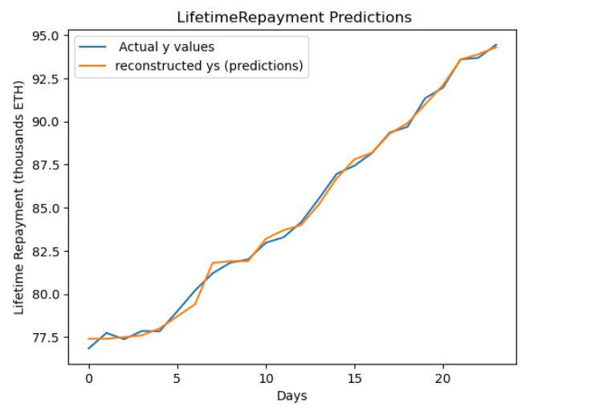
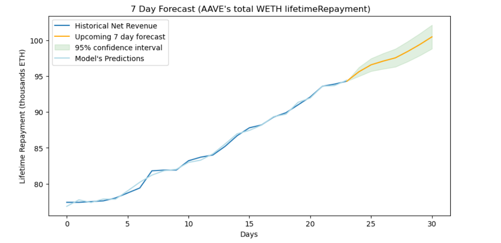

# Provable MLR: Forecasting AAVE's Lifetime Repayments

<figure><figcaption></figcaption></figure>

For this particular tutorial, we will build a Closed-Form Multiple Linear Regression algorithm and use it to forecast AAVE's (WETH Pool) future projected Lifetime Repayments as a practical example. Towards the second half-end of the tutorial, we will convert the model to Cairo enabling us to make the entire MLR system as well as the forecasts fully provable & verifiable.

## Provability & Verifiability

The key benefit of this Lightweight Multiple Linear Regression Solver lies in its commitment to Provability and Verifiability. By utilizing Cairo & Orion, the entire MLR system becomes inherently provable through STARKs, offering unparalleled transparency. This enables every inference of the model construction, execution, and prediction phase to be transparently proved using e.g. LambdaClass STARK Prover. In essence, the Provability and Verifiability aspect ensures that the tool is not only for prediction but also a framework to build accountability and trust in on-chain business environments.

## Brief intro to MLR

To give a brief overview of MLR, it is used to model the relationship between a single dependent variable denoted as `y`, and multiple independent variables, such as `x1`, `x2`, etc. This method extends the principles of simple linear regression by allowing us to incorporate multiple explanatory factors to predict y. The significant advantage lies in its capability to evaluate both individual and joint linear relationships between each feature and the target variable, providing a comprehensive understanding of how changes in predictors correspond to changes in the outcome.

$$
y = β0 + (β1 * x1) + (β2 * x2) + ... + (βn * xn) + e \quad \begin{align*} y & \text{= dependent variable} \\ x1,x2..xn & \text{= independent variables} \\ β0 & \text{= intercept } \\ β1,β2...βn & \text{= regression coefficients} \\ ε & \text{= error term} \\ \end{align*}
$$

The regression coefficients, illustrated by `β0`, `β1`...`βn` play a pivotal role in quantifying the impact of each feature variable on the dependent variable. It not only enables us to discern the individual impact (magnitude and direction) but also unveils how they collaboratively combine to shape outcomes.

In summary, when incorporating multiple factors into our model, we can improve the prediction & forecasting accuracy when compared to relying solely on a single predictor, as seen with simple regression. This enhancement can be mainly attributed to the fact that real-world outcomes being typically influenced by a myriad of factors. Therefore, leveraging multiple linear regression (MLR) serves as a foundational stepping stone to adeptly capture the intricate relationships between features and labels, ultimately guiding us in building accurate and highly interpretable models.

## Closed-form approach for computing MLR gradients

As outlined above, MLR still remains a powerful tool for problem-solving in many data-oriented business applications. As we step into the ProvableML domain to enhance model transparency, these algorithms still prove to be highly advantageous in on-chain environments due to their lightweight, interpretable, and cost-efficient attributes.

Traditionally, the common approach to MLR involves computing pseudo-inverses and Singular Value Decomposition (SVD). While robust, their implementation complexity can often overshadow the regression problem at hand. Consequently, gradient-based methods are often preferred in data science projects, but this also can be deemed excessive due to the resource-intensive iterative approach taken to approximate gradients which can be very costly. In addition to this, the manual hyperparameter tuning required can be a significant hindrance, especially in automated on-chain environments.

In light of these considerations, this tutorial introduces an intuitive closed-form approach to calculating MLR gradients without any hyperparameter tuning, making it easy to implement and run MLR algorithms effectively on Starknet. This approach also makes it easy to estimate computational steps/costs required to run MLR given a dataset.

The closed-form MLR comprises of three integral components:

1. Orthogonalization of Input Features: Ensures independence among the X features.
2. Gradient Calculation: Computes the exact gradient between each decorrelated X feature and y variable.
3. Forecasting & Predictions: Utilizes the computed coefficients to make new predictions.

## Python implementation

To demonstrate a realistic end-to-end implementation, we'll first work with the AAVE dataset before delving into the implementation of the MLR Solver. Step by step, we'll implement the full process in Python first, which should lay the groundwork to allow us to make a seamless transition to Cairo in the subsequent stages of this tutorial.

### Preparing the AAVE dataset

To begin with, we will use the Aave dataset which can be accessed from this [link](https://app.aavescan.com/). We will work with our cleaned-up version of the dataset which includes various business metrics such as liquidity incentives and borrowing rates, providing valuable insights for forecasting future lifetime repayments.

```python
import pandas as pd
import numpy as np
import matplotlib.pyplot as plt
import os
from sklearn.metrics import r2_score
# dataset pulled from https://app.aavescan.com/  
df_main= pd.read_csv('AAVE-V3-weth.csv')
df_main.drop('Unnamed: 0', axis=1, inplace=True)
# Order the DataFrame from the oldest to the most recent datapoint based on the date
df_main= df_main.iloc[::-1]

#Since Most of the df values are in wei we divide all values by a fixed factor to make the data easy to work with.
# Dividing by 1e+22 converts values to thousands of ETH and prevents overflow as we transition to Cairo later.
factor = 1e+22
df_main = df_main/factor

days_to_forecast = -7
# Our y variable to train on
df['lifetimeRepayments_7day_forecast'] = df[['lifetimeRepayments']].shift(days_to_forecast) 
df = df[0:days_to_forecast]
```

|    | accruedToTreasury | availableLiquidity | lifetimeFlashLoans | lifetimeLiquidity | lifetimeReserveFactorAccrued | totalLiquidityAsCollateral | totalScaledVariableDebt | lifetimeRepayments | variableBorrowRate | lifetimeRepayments\_7day\_forecast |
| -- | ----------------- | ------------------ | ------------------ | ----------------- | ---------------------------- | -------------------------- | ----------------------- | ------------------ | ------------------ | ---------------------------------- |
| 30 | 0.000933          | 7.40               | 12.4               | 204.0             | 0.0550                       | 119.0                      | 28.7                    | 76.4               | 3370.0             | 77.4                               |
| 29 | 0.001340          | 7.45               | 12.4               | 205.0             | 0.0550                       | 119.0                      | 28.7                    | 76.4               | 3370.0             | 77.4                               |
| 28 | 0.001740          | 8.02               | 12.4               | 207.0             | 0.0550                       | 119.0                      | 28.8                    | 76.5               | 3320.0             | 77.5                               |
| 27 | 0.002120          | 9.59               | 12.8               | 212.0             | 0.0550                       | 124.0                      | 28.6                    | 77.0               | 3180.0             | 77.6                               |
| 26 | 0.000017          | 10.00              | 14.1               | 215.0             | 0.0575                       | 128.0                      | 28.7                    | 77.3               | 3150.0             | 78.0                               |

In order to separate the feature and label of our dataset, we have replicated the lifetime repayments column into a new target variable column whilst shifting its values up by 7 rows. This aligns each repayment value with the appropriate features from 7 days prior. Consequently, the `lifetimeRepayments_7day_forecast` column will serve as our predictive label (y), while the other metrics across the same rows become our explanatory variables (X) for predicting future repayments.

By framing our features and labels in this format, we will be able to train the MLR model to be able to estimate the daily lifetime repayments based on current lending pool metrics.

### Data normalization

We will now normalize the data using min-max scaling to transform all features and labels into a common 0-1 range.

```python
def normalize_data(original_data):
    data_min = np.min(original_data, axis=0)
    data_max = np.max(original_data, axis=0)
    data_range = data_max - data_min
    data_normalized =  (original_data - data_min) / data_range
    return data_normalized

#Drop the y label from dataframe
features = df.drop(['lifetimeRepayments_7day_forecast'], axis=1)
#setting our y label
target = df['lifetimeRepayments_7day_forecast']
# convert data to numpy format
X_original = features.to_numpy()
Y_original = target.to_numpy()
# normalize the data 
X_normalized= normalize_data(X_original)
y_normalized= normalize_data(Y_original)

```

### Computing MLR gradients

As outlined in the prior section, this closed-form approach to computing the regression coefficients does not rely on gradient descent. Instead, it orthogonalizes the x feature variables, ensuring independence across predictors. It then calculates the gradient between the orthogonalized x features and the y variable. This approach allows us to compute the exact coefficients in a single step, eliminating the need for iterative approximations.

It's very important to notice that in the `decorrelate_features` function, only the last feature row is fully orthogonalized. The rest of the features are decorelated from one another but are not fully orthogonal to each other. This is done to save on computational costs and make the algorithm more efficient since we can still compute the coefficients without necessarily needing to fully orthogonalize them.

This is better illustrated in the `calculate_gradients` function, as the process starts from the last fully orthogonalized X feature. Subsequently, it then computes the corresponding gradient and removes this feature's influence from the y label. By iteratively repeating this process across all features we can compute the gradient without the need to have all features fully orthogonalized since we are also removing their influences from the y label iteratively. This streamlined approach reduces computational steps and memory requirements, enhancing the algorithm's efficiency and performance.

```python
#We will first transpose the X features and add a bias term.
def transpose_and_add_bias(feature_data):
    transposed_data= feature_data.T
    transposed_data_with_bias = np.vstack((transposed_data, np.ones(transposed_data.shape[1])))
    return transposed_data_with_bias

# decorrelate the features (only the last feature row will be fully orthogonal)
def decorrelate_features(feature_data):
    x_temp = feature_data.copy()
    feature_rows = feature_data.shape[0]
    # Decorrelate features
    for i in range(feature_rows):
        feature_squared = np.sum(x_temp[i]**2)
        for j in range(i+1, feature_rows):
            feature_cross_prod = np.sum(x_temp[i] * x_temp[j])
            if feature_squared == 0:
                print('Warning, division by zero encountered and handled')
                feature_squared = 1e-8 
            feature_grad = feature_cross_prod / feature_squared
            x_temp[j] -= feature_grad * x_temp[i]
    decorelated_x_vals = x_temp
    return decorelated_x_vals

# compute the exact gradients for each feature variable, including the bias term
def calculate_gradients(decorelated_x_vals, y_values, original_x_features):
    y_temp = y_values.copy()
    feature_rows = decorelated_x_vals.shape[0]
    gradients = np.zeros(feature_rows)
    # Calculate gradients
    for i in range(feature_rows-1, -1, -1):
        prod = np.sum(y_temp * decorelated_x_vals[i])
        squared = np.sum(decorelated_x_vals[i] * decorelated_x_vals[i])
        if squared == 0:
            print('Warning, division by zero encountered and handled')
            squared = 1e-8
        gradients[i] = prod / squared
        y_temp -= gradients[i] * original_x_features[i]
    return gradients

X_normalized_transposed_with_bias = transpose_and_add_bias(X_normalized)
decorrelated_X_features = decorrelate_features(X_normalized_transposed_with_bias)
gradient_values = calculate_gradients(decorrelated_X_features, y_normalized, X_normalized_transposed_with_bias )

real_gradient_values_reversed = np.flip(gradient_values)
print('All regression coefficient values, including the bias term: ', real_gradient_values_reversed )

>> All regression coefficient values, including the bias term:  [-1.27062243  1.15931271  0.173401   -0.31112069, 1.09338439 0.93959362 -1.12956438 -0.08371113  1.18734043  0.3425375 ]

```

### Reconstructing the y labels using the calculated gradients and X feature data

Using the computed regression coefficients we can now rebuild the y labels to see how well they fit to the dataset. In order to achieve this we simply compute the dot product between the calculated coefficient values and original X feature values.

```python
def denormalize_data(original_data,normalized_data):
    data_min = np.min(original_data)
    data_max = np.max(original_data)
    data_range = data_max - data_min
    
    denormalize_data = ( normalized_data * data_range) + data_min
    return denormalize_data

y_pred_norm = gradient_values @ X_normalized_transposed_with_bias #prediction#
reconstructed_y = denormalize_data(Y_original,y_pred_norm) 
# Plot the denormalized y values
plt.figure(2)
plt.title(" LifetimeRepayment Predictions")
plt.plot(reconstructed_y )
plt.plot(Y_original)
plt.legend([" Actual y values", "reconstructed ys (predictions)"])
plt.xlabel('Days')
plt.ylabel('Lifetime Repayment (thousands ETH)')

# Calculate R^2 score for denormalized prediction
accuracy_denormalized = r2_score(Y_original, reconstructed_y)
print("R^2 score (denormalized):", accuracy_denormalized)
>>R^2 score (denormalized): 0.9968099033369738
```

<figure><figcaption></figcaption></figure>

### Forecasting the upcoming 7-Day Lifetime Repayments Projections for AAVE's WETH Pool

With the model now fitted, we can use the most recent data points to forecast future repayments projections. Additionally, we will calculate the uncertainty bounds of a 95% confidence interval for these predictions to quantify the reliability of our repayment projections based on the model's historical accuracy across the training data. By using both estimates of prediction and confidence intervals, we provide both repayment expectations and precision guidance that can help in business planning.

```python
df_forecast = df_main[-7:]
df_forecast_data = df_forecast.to_numpy()
#normalize data
X_min = np.min(X_original, axis=0)
X_max = np.max(X_original, axis=0)
X_range = X_max - X_min
df_forecast_data_normalized =    (df_forecast_data - X_min) / X_range
# transpose the matrix and add bias 
df_forecast_data_normalized_transposed= df_forecast_data_normalized.T
df_forecast_data_normalized_transposed_with_bias = np.vstack((df_forecast_data_normalized_transposed, np.ones(df_forecast_data_normalized_transposed.shape[1])))
#normalized forecasts 
forecast_normalized = gradient_values @ df_forecast_data_normalized_transposed_with_bias
#denormalize forecast
Y_min = np.min(Y_original, axis=0)
Y_max = np.max(Y_original, axis=0)
Y_range = Y_max - Y_min
#denormalize forecast
Y_min = np.min(Y_original, axis=0)
Y_max = np.max(Y_original, axis=0)
Y_range = Y_max - Y_min
forecast_pred =  (forecast_normalized * Y_range) + Y_min
forecast_plot_data = np.insert(forecast_pred, 0, Y_original[-1])
# Calculate expanding confidence intervals
residual = Y_original - reconstructed_y
stderr = np.std(residual)
z_score = 1.96 # z-score for 95% CI
intervals = z_score *stderr * np.sqrt(np.arange(len(forecast_plot_data)))

# Creating the plot
plt.figure(figsize=(10, 5))
plt.plot(Y_original , label='Historical Lifetime Repayments')
plt.plot(len(Y_original)-1 + np.arange(len(forecast_plot_data)), forecast_plot_data , color='orange', label='Upcoming 7 day forecast')
plt.fill_between(len(Y_original)-1 + np.arange(len(forecast_plot_data)),  
                 (forecast_plot_data - intervals),
                 (forecast_plot_data + intervals),
                 alpha=0.12,
                color='green',
                label='95% confidence interval')


plt.plot(reconstructed_y ,  label="Model's Predictions", color='lightblue')
# Adding labels and title
plt.xlabel('Days')
plt.ylabel('Lifetime Repayment (thousands ETH)')
plt.title(" 7 Day Forecast (AAVE's total WETH lifetimeRepayment)")
plt.legend()
# Display the plot
plt.show()

##forecast_pred values
## Day 1 Forecast:  95.62317677745183
## Day 2 Forecast 96.5934311440076
## Day 3 Forecast 97.113932324072
## Day 4 Forecast 97.5688580115012
## Day 5 Forecast 98.45026776663158
## Day 6 Forecast 99.42560920294711
## Day 7 Forecast 100.49892105541984
```

<figure><figcaption></figcaption></figure>

## Transition to Cairo

Now that we have covered all the steps for constructing and fitting the MLR model using the AAVE dataset in Python, our subsequent step will be to implement it in Cairo. This transition will provide end-to-end provability across all aspects of the multiple linear regression system.

In order to catalyze our development we will leverage Orion's built-in functions and operators to construct the MLR Solver and use it to forecast AAVE's Lifetime Repayments.

### Code Structure

The outlined code structure below should serve as a guide to help with our implementation as we will be working within multiple folders.

```
.
|
├── datasets
|   ├── aave_data
|   |   ├── aave_x_features.cairo
|   |   └── aave_y_labels.cairo
│   ├── user_inputs_data
|   |   └── aave_weth_revenue_data_input.cairo
|   ├── aave_data.cairo
|   └── user_inputs_data.cairo
├── src
│   ├── data_preprocessing.cairo
│   ├── datasets.cairo
│   ├── helper_functions.cairo
│   ├── lib.cairo
│   ├── model.cairo.cairo
│   └── test.cairo
├── Scarb.toml
├── Scarb.lock |
└── target
```

### Setting up the Scarb project

Scarb is the Cairo package manager specifically created to streamline our Cairo development process. Scarb will typically manage project dependencies, the compilation process (both pure Cairo and Starknet contracts), and downloading and building external libraries such as Orion.You can find all the information about Scarb and Cairo installation [here](../../framework/get-started.md).

To create a new Scarb project, open your terminal and run:

```sh
scarb new multiple_linear_regression
```

A new project folder should be created for you and make sure to replace the content in Scarb.toml file with the following code:

```toml
[package]
name = "multiple_linear_regression"
version = "0.1.0"
[dependencies]
orion = { git = "https://github.com/gizatechxyz/onnx-cairo" }
[scripts]
test = "scarb cairo-test -f multiple_linear_regression_test"
```

Now let's replace the contents of `src/lib.cairo` with the following code. This will let our compiler know which files to include during the compilation of our code.

```shell
mod test;
mod data_preprocessing;
mod helper_functions;
mod datasets;
mod model;
```

### Converting the dataset to Cairo

To convert the AAVE dataset to Cairo let's execute the following Python code. This simply creates a new `datasets` folder for us and converts the x and y variables into Orion's 16x16 tensor format.

Orion's 16x16 tensor format was chosen for this particular tutorial, due to having a relatively good degree of accuracy for both the integer part and decimal part relative to our AAVE dataset.

```python
# Convert the original data to Cairo 
def generate_cairo_files(data, name, folder_name):
    os.makedirs(f'multiple_linear_regression/src/datasets/{folder_name}', exist_ok=True)
    with open(os.path.join('multiple_linear_regression/src/datasets', f'{folder_name}', f"{name}.cairo"), "w") as f:
            f.write(
                "use array::ArrayTrait;\n" +
                "use orion::numbers::fixed_point::implementations::fp16x16::core::{FP16x16Impl, FP16x16PartialEq };\n" +
                "use orion::operators::tensor::{Tensor, TensorTrait, FP16x16Tensor};\n" +
                "use orion::numbers::{FP16x16, FixedTrait};\n\n" +
                "fn {0}() ->  Tensor<FP16x16>  ".format(name) + "{\n" +
                "    let tensor = TensorTrait::<FP16x16>::new( \n"
            )
            if len(data.shape)>1:
                f.write("    shape: array![{0},".format(data.shape[0]))
                f.write("{0}].span(),\n".format(data.shape[1]))
                f.write(
                    "    data: array![ \n"
                )
            if len(data.shape)==1:
                f.write("    shape: array![{0}].span(),\n".format(data.shape[0]))
                f.write(
                    "    data: array![ \n"
                )
            for val in np.nditer(data.flatten()):
                f.write("    FixedTrait::new({0}, {1} ),\n".format(abs(int(val * 2**16)), str(val < 0).lower()))
            f.write(
                "].span() \n \n" +
                ");\n\n"+
                "return tensor; \n"+
                "}"
            )
    with open(os.path.join('multiple_linear_regression/src/datasets', f'{folder_name}.cairo'), 'a') as f:
        f.write(f"mod {name};\n")
        
generate_cairo_files(X_original, 'aave_x_features', 'aave_data')
generate_cairo_files(Y_original, 'aave_y_labels', 'aave_data')
generate_cairo_files(df_forecast_data, 'aave_weth_revenue_data_input', 'user_inputs_data')
```

The converted x and y values will now be populated into `aave_x_features.cairo` and `aave_y_labels.cairo`, which should be found under the `src/dataset/aave_data` folder.

On the other hand, the `aave_weth_revenue_data_input` will populated into `src/dataset/user_inputs_data` which is a separate folder. The `aave_weth_revenue_data_input` represents the latest AAVE's WETH lending pool metrics, which will be later used for performing the 7-day lifetime repayments forecasts.

Now that we have placed the files into this new folder structure, we need to make sure that the files are still accessible to the compiler. Hence, let's create the files `aave_data.cairo` and `user_inputs_data.cairo` and add the following module references accordingly.

```rust
// in aave_data.cairo
mod aave_x_features;
mod aave_y_labels;
```

```rust
// in user_inputs_data.cairo
mod aave_weth_revenue_data_input;
```

### Data Preprocessing

Now that our dataset has been generated, it is crucial to implement data normalization before feeding it into the MLR Solver. This is highly recommended for any future MLR implementation in Cairo to mitigate potential overflow issues during subsequent stages. This is due to the MLR closed-form approach involving squaring x values, which can get very large if left unnormalized.

To facilitate this process, we will establish a dedicated Cairo file named `data_preprocessing.cairo` which should be located under the main `src` folder. This file will store all our data preprocessing functions, including the min-max normalization function.

```rust
// importing libs
use orion::operators::tensor::{
    Tensor, TensorTrait, FP16x16Tensor, U32Tensor, U32TensorAdd, FP16x16TensorSub, FP16x16TensorAdd,
    FP16x16TensorDiv, FP16x16TensorMul
};
use orion::numbers::{FP16x16, FixedTrait};
use multiple_linear_regression::helper_functions::{
    get_tensor_data_by_row, transpose_tensor, calculate_mean, calculate_r_score,
    normalize_user_x_inputs, rescale_predictions
};

#[derive(Copy, Drop)]
struct Dataset {
    x_values: Tensor<FP16x16>,
    y_values: Tensor<FP16x16>,
}

#[generate_trait]
impl DataPreprocessing of DatasetTrait {
    fn normalize_dataset(ref self: Dataset) -> Dataset {
        let mut x_values = TensorTrait::<FP16x16>::new(array![1].span(), array![FixedTrait::new(0, false)].span());
        let mut y_values = TensorTrait::<FP16x16>::new(array![1].span(), array![FixedTrait::new(0, false)].span());
        // used for multiple_linear_regression_models
        if self.x_values.shape.len() > 1 {
            x_values = normalize_feature_data(self.x_values);
            y_values = normalize_label_data(self.y_values);
        }
        // used for linear_regression_models
        if self.x_values.shape.len() == 1 {
            x_values = normalize_label_data(self.x_values);
            y_values = normalize_label_data(self.y_values);
        }

        return Dataset { x_values, y_values };
    }
}

// normalizes 2D Tensor
fn normalize_feature_data(tensor_data: Tensor<FP16x16>) -> Tensor<FP16x16> {
    let mut x_min_array = ArrayTrait::<FP16x16>::new();
    let mut x_max_array = ArrayTrait::<FP16x16>::new();
    let mut x_range_array = ArrayTrait::<FP16x16>::new();
    let mut normalized_array = ArrayTrait::<FP16x16>::new();
    // transpose to change rows to be columns
    let transposed_tensor = tensor_data.transpose(axes: array![1, 0].span());
    let tensor_shape = transposed_tensor.shape;
    let tensor_row_len = *tensor_shape.at(0); // 13 
    let tensor_column_len = *tensor_shape.at(1); //50
    // loop and append max and min row values to the corresponding  array
    let mut i: u32 = 0;
    loop {
        if i >= tensor_row_len {
            break ();
        }
        let mut transposed_tensor_row = get_tensor_data_by_row(transposed_tensor, i);
        x_max_array.append(transposed_tensor_row.max_in_tensor());
        x_min_array.append(transposed_tensor_row.min_in_tensor());
        x_range_array
            .append(transposed_tensor_row.max_in_tensor() - transposed_tensor_row.min_in_tensor());
        i += 1;
    };
    // convert array to tensor format for ease of math operation
    let mut x_min = TensorTrait::<
        FP16x16
    >::new(shape: array![1, tensor_row_len].span(), data: x_min_array.span());
    let mut x_range = TensorTrait::<
        FP16x16
    >::new(shape: array![1, tensor_row_len].span(), data: x_range_array.span());
    let normalized_tensor = (tensor_data - x_min) / x_range;
    return normalized_tensor;
}

// normalizes 1D tensor
fn normalize_label_data(tensor_data: Tensor<FP16x16>) -> Tensor<FP16x16> {
    let mut tensor_data_ = tensor_data;
    let mut normalized_array = ArrayTrait::<FP16x16>::new();
    let mut range = tensor_data.max_in_tensor() - tensor_data.min_in_tensor();
    // loop through tensor values normalizing and appending to a new array
    let mut i: u32 = 0;

    loop {
        match tensor_data_.data.pop_front() {
            Option::Some(tensor_val) => {
                let mut diff = *tensor_val - tensor_data.min_in_tensor();
                normalized_array.append(diff / range);
                i += 1;
            },
            Option::None => { break; }
        };
    };
    // convert normalized array values to tensor format
    let mut normalized_tensor = TensorTrait::<
        FP16x16
    >::new(shape: array![tensor_data.data.len()].span(), data: normalized_array.span());
    return normalized_tensor;
}

```

Looking at the code above, we also have implemented a new `Dataset` struct to encapsulate the predictor features (x\_values) and target variable (y\_values) into a single reusable data object. By bundling x and y into Dataset, we can easily implement new methods into it such as the `normalize_dataset()`, allowing for a seamless normalization of both components simultaneously. This approach not only streamlines normalization operations in a single step but also eliminates redundant logic.

### The MLR Solver in Cairo

To keep everything organized let's now make a new folder named `model` under the main `src` folder. Within it, we will create a dedicated Cairo file named `multiple_linear_regression_model.cairo` to host all our MLR functions in Cairo.

All of the function MLR functions implemented can be seen below:

```rust
use orion::operators::tensor::{
    Tensor, TensorTrait, FP16x16Tensor, U32Tensor, U32TensorAdd, FP16x16TensorSub, FP16x16TensorAdd,
    FP16x16TensorDiv, FP16x16TensorMul
};
use orion::numbers::{FP16x16, FixedTrait};
use multiple_linear_regression::data_preprocessing::{Dataset, DatasetTrait};
use multiple_linear_regression::helper_functions::{
    get_tensor_data_by_row, transpose_tensor, calculate_mean, calculate_r_score,
    normalize_user_x_inputs, rescale_predictions
};


#[derive(Copy, Drop)]
struct MultipleLinearRegressionModel {
    coefficients: Tensor<FP16x16>
}

#[generate_trait]
impl RegressionOperation of MultipleLinearRegressionModelTrait {
    // reconstruct the y values using the computed gradients and x values
    fn predict(
        ref self: MultipleLinearRegressionModel, feature_inputs: Tensor<FP16x16>
    ) -> Tensor<FP16x16> {
        // random tensor value that we will replace
        let mut prediction_result = TensorTrait::<
            FP16x16
        >::new(shape: array![1].span(), data: array![FixedTrait::new(10, false)].span());

        let mut result = ArrayTrait::<FP16x16>::new();
        // for multiple predictions
        if feature_inputs.shape.len() > 1 {
            let feature_values = add_bias_term(feature_inputs, 1);
            let mut data_len: u32 = *feature_values.shape.at(0);
            let mut i: u32 = 0;
            loop {
                if i >= data_len {
                    break ();
                }
                let feature_row_values = get_tensor_data_by_row(feature_values, i);
                let predicted_values = feature_row_values.matmul(@self.coefficients);
                result.append(*predicted_values.data.at(0));
                i += 1;
            };
            prediction_result =
                TensorTrait::<
                    FP16x16
                >::new(shape: array![result.len()].span(), data: result.span());
        }

        // for single predictions 
        if feature_inputs.shape.len() == 1 && self.coefficients.data.len() > 1 {
            let feature_values = add_bias_term(feature_inputs, 1);
            prediction_result = feature_values.matmul(@self.coefficients);
        }

        return prediction_result;
    }
}

fn MultipleLinearRegression(dataset: Dataset) -> MultipleLinearRegressionModel {
    let x_values_transposed = transpose_tensor(dataset.x_values);
    let x_values_transposed_with_bias = add_bias_term(x_values_transposed, 0);
    let decorrelated_x_features = decorrelate_x_features(x_values_transposed_with_bias);
    let coefficients = compute_gradients(
        decorrelated_x_features, dataset.y_values, x_values_transposed_with_bias
    );
    return MultipleLinearRegressionModel { coefficients };
}

//Adds bias term to features based on axis
fn add_bias_term(x_feature: Tensor<FP16x16>, axis: u32) -> Tensor<FP16x16> {
    let mut x_feature_ = x_feature;
    let mut tensor_with_bias = TensorTrait::<
        FP16x16
    >::new(shape: array![1].span(), data: array![FixedTrait::new(10, false)].span());
    let mut result = ArrayTrait::<FP16x16>::new();
    // check if feature data has multiple rows and columns
    if x_feature.shape.len() > 1 {
        let mut index: u32 = 0;
        if axis == 1 {
            index = 0;
        } else {
            index = 1;
        }
        let data_len = *x_feature.shape.at(index); // 50
        let mut i: u32 = 0;
        loop {
            if i >= data_len {
                break ();
            }
            result
                .append(FixedTrait::new(65536, false)); //65536=ONE in FP16x16, change accordingly  
            i += 1;
        };
        if axis == 0 {
            let res_tensor = TensorTrait::new(
                shape: array![1, data_len].span(), data: result.span()
            );
            tensor_with_bias =
                TensorTrait::concat(tensors: array![x_feature, res_tensor].span(), axis: axis);
        } else {
            let res_tensor = TensorTrait::new(
                shape: array![data_len, 1].span(), data: result.span()
            );
            tensor_with_bias =
                TensorTrait::concat(tensors: array![x_feature, res_tensor].span(), axis: axis);
        }
    }
    // check if feature data is 1D
    if x_feature.shape.len() == 1 {
        let mut j: u32 = 0;
        loop {
            match x_feature_.data.pop_front() {
                Option::Some(x_val) => {
                    result.append(*x_val);
                    j += 1;
                },
                Option::None => { break; }
            };
        };
        result.append(FixedTrait::new(65536, false)); //65536=ONE in FP16x16, change accordingly  
        tensor_with_bias =
            TensorTrait::<FP16x16>::new(shape: array![result.len()].span(), data: result.span());
    }
    return tensor_with_bias;
}

// decorrelates the feature data (*only the last tensor row of the decorrelated feature data will be fully orthogonal)
fn decorrelate_x_features(x_feature_data: Tensor<FP16x16>) -> Tensor<FP16x16> {
    let mut input_tensor = x_feature_data;

    let mut i: u32 = 0;
    loop {
        if i >= *x_feature_data.shape.at(0) {
            break ();
        }
        let mut placeholder = ArrayTrait::<FP16x16>::new();
        let mut feature_row_values = get_tensor_data_by_row(input_tensor, i);
        let mut feature_squared = feature_row_values.matmul(@feature_row_values);
        // avoiding division by zero errors
        if *feature_squared.data.at(0) == FixedTrait::new(0, false) {
            feature_squared =
                TensorTrait::<
                    FP16x16
                >::new(shape: array![1].span(), data: array![FixedTrait::new(10, false)].span());
        }
        // loop through remaining tensor data and remove the individual tensor factors from one another 
        let mut j: u32 = i + 1;
        loop {
            if j >= *x_feature_data.shape.at(0) {
                break ();
            }
            let mut remaining_tensor_values = get_tensor_data_by_row(input_tensor, j);
            let feature_cross_product = feature_row_values.matmul(@remaining_tensor_values);
            let feature_gradients = feature_cross_product / feature_squared;
            remaining_tensor_values = remaining_tensor_values
                - (feature_row_values
                    * feature_gradients); //remove the feature factors from one another
            // loop and append the modified remaining_tensor_values (after the correlated factor has been removed) to the placeholder array
            let mut k: u32 = 0;
            loop {
                if k >= remaining_tensor_values.data.len() {
                    break ();
                }
                placeholder.append(*remaining_tensor_values.data.at(k));
                k += 1;
            };

            j += 1;
        };
        // convert placeholder array to tensor format and update the original tensor with the new modified decorrelated tensor row values
        let mut decorrelated_tensor = TensorTrait::new(
            shape: array![*x_feature_data.shape.at(0) - 1 - i, *x_feature_data.shape.at(1)].span(),
            data: placeholder.span()
        );
        let mut original_tensor = input_tensor
            .slice(
                starts: array![0, 0].span(),
                ends: array![i + 1, *x_feature_data.shape.at(1)].span(),
                axes: Option::None(()),
                steps: Option::Some(array![1, 1].span())
            );
        input_tensor =
            TensorTrait::concat(
                tensors: array![original_tensor, decorrelated_tensor].span(), axis: 0
            );
        i += 1;
    };
    return input_tensor;
}

// computes the corresponding MLR gradient using decorrelated feature
fn compute_gradients(
    decorrelated_x_features: Tensor<FP16x16>,
    y_values: Tensor<FP16x16>,
    original_x_tensor_values: Tensor<FP16x16>
) -> Tensor<FP16x16> {
    let mut gradient_values_flipped = TensorTrait::<
        FP16x16
    >::new(shape: array![1].span(), data: array![FixedTrait::new(10, false)].span());

    let mut result = ArrayTrait::<FP16x16>::new();
    let mut tensor_y_vals = y_values;
    let mut i: u32 = *decorrelated_x_features.shape.at(0);
    // loop through Decorrelated_x_features starting from the fully orthogonalized last tensor row values
    loop {
        if i <= 0 {
            break ();
        }
        let index_val = i - 1;
        let mut decorelated_feature_row_values = get_tensor_data_by_row(
            decorrelated_x_features, index_val
        ); 
        let mut decorelated_features_squared = decorelated_feature_row_values
            .matmul(@decorelated_feature_row_values);
        let mut feature_label_cross_product = tensor_y_vals
            .matmul(@decorelated_feature_row_values); // multiply the tensors
        // avoiding division by zero errors
        if *decorelated_features_squared.data.at(0) == FixedTrait::new(0, false) {
            decorelated_features_squared =
                TensorTrait::<
                    FP16x16
                >::new(shape: array![1].span(), data: array![FixedTrait::new(10, false)].span());
        }
        // computing the feature gradient values using the y values and decorrelated x features and appending them to array
        let mut single_gradient_value = feature_label_cross_product
            / decorelated_features_squared; // divide the summed value by each other
        result.append(*single_gradient_value.data.at(0));
        // remove the associated feature gradient value away from y values
        let mut original_x_tensor_row_values = get_tensor_data_by_row(
            original_x_tensor_values, index_val
        );
        tensor_y_vals = tensor_y_vals
            - (original_x_tensor_row_values
                * single_gradient_value); //remove the first feature from the second feature values
        i -= 1;
    };
    // convert the gradient array to tensor format
    let final_gradients = TensorTrait::new(
        shape: array![*decorrelated_x_features.shape.at(0)].span(), data: result.span()
    );

    let mut reverse_grad_array = ArrayTrait::<FP16x16>::new();
    let mut data_len: u32 = final_gradients.data.len();
    loop {
        if data_len <= 0 {
            break ();
        }
        let temp_val = data_len - 1;
        reverse_grad_array.append(*final_gradients.data.at(temp_val));
        data_len -= 1;
    };
    // convert gradient values to tensor format
    let gradient_values_flipped = TensorTrait::<
        FP16x16
    >::new(shape: array![reverse_grad_array.len()].span(), data: reverse_grad_array.span());

    return gradient_values_flipped;
}
```

At the core of this file lies the pivotal `MultipleLinearRegression()` function, which orchestrates the entire model fitting process. This function plays a central role by invoking critical functions such as `Decorrelate_x_features()`, `add_bias_term()`, and `compute_gradients()`, to calculate the regression coefficients. It is important to notice that the output of the `MultipleLinearRegression` function returns the newly created `MultipleLinearRegressionModel` object type. This is done to encapsulate the trained model parameters into a reusable bundle that contains the fitted coefficients.

We have also implemented a `predict()` method into the new `MultipleLinearRegressionModel` struct which should enable us to generate new predictions and forecasts by simply passing the new feature X inputs to the function. This modular approach avoids the need to re-fit the model each time when making new predictions allowing us to store, access, and conveniently manipulate model coefficients.

Once again to ensure that the file is accessible to the compiler we need to also add a reference module. For this, let's create the file named `model.cairo` under the main `src` folder and add the following:

```rust
// in model.cairo
mod multiple_linear_regression_model;
```

### Helper functions

Now let's create an additional file named `helper_functions.cairo` under the main `src` folder which will host all our helper functions required to construct the MLR Solver. Some of these functions stored here will also be used later during the testing phase to assess the model's performance once fitted. This file consists of multiple functions some of which include:

* Function to help with retrieving tensor data by row and column index, which are essential for MLR construction
* Function to compute the accuracy of our model using the R-squared method
* A function for computing tensor means used in testing.
* Functions dedicated to normalizing feature inputs, enabling accurate predictions and forecasts.
* A rescaling function tailored to adjust prediction results to appropriate sizes.

```rust
use debug::PrintTrait;
use array::{ArrayTrait, SpanTrait};
use orion::operators::tensor::{
    Tensor, TensorTrait, FP16x16Tensor, U32Tensor, U32TensorAdd, FP16x16TensorSub, FP16x16TensorAdd,
    FP16x16TensorDiv, FP16x16TensorMul
};

use orion::numbers::{FP16x16, FixedTrait};

// retrieves row data by index in a 2D tensor
fn get_tensor_data_by_row(tensor_data: Tensor<FP16x16>, row_index: u32,) -> Tensor<FP16x16> {
    let column_len = *tensor_data.shape.at(1); //13
    // create new array
    let mut result = ArrayTrait::<FP16x16>::new();
    // loop through the x values and append values 
    let mut i: u32 = 0;
    loop {
        if i >= column_len {
            break ();
        }
        result.append(tensor_data.at(indices: array![row_index, i].span()));
        i += 1;
    };
    let resultant_tensor = TensorTrait::<
        FP16x16
    >::new(array![column_len].span(), data: result.span());
    return resultant_tensor;
}


// transposes tensor
fn transpose_tensor(tensor_data: Tensor<FP16x16>) -> Tensor<FP16x16> {
    let tensor_transposed = tensor_data.transpose(axes: array![1, 0].span());
    return tensor_transposed;
}

fn calculate_mean(tensor_data: Tensor<FP16x16>) -> FP16x16 {
    let tensor_size = FixedTrait::<FP16x16>::new_unscaled(tensor_data.data.len(), false);
    let cumulated_sum = tensor_data.cumsum(0, Option::None(()), Option::None(()));
    let sum_result = cumulated_sum.data[tensor_data.data.len() - 1];
    let mean = *sum_result / tensor_size;
    return mean;
}

// Calculates the R-squared score between two tensors.
fn calculate_r_score(Y_values: Tensor<FP16x16>, Y_pred_values: Tensor<FP16x16>) -> FP16x16 {
    let mut Y_values_ = Y_values;
    let mean_y_value = calculate_mean(Y_values);
    // creating the appropriate tensor shapes and empty arrays to populate values into
    let mut squared_diff_shape = array::ArrayTrait::new();
    squared_diff_shape.append(Y_values.data.len());
    let mut squared_diff_vals = array::ArrayTrait::new();
    let mut squared_mean_diff_shape = array::ArrayTrait::new();
    squared_mean_diff_shape.append(Y_values.data.len());
    let mut squared_mean_diff_vals = array::ArrayTrait::new();

    let mut i: u32 = 0;

    loop {
        match Y_values_.data.pop_front() {
            Option::Some(y_value) => {
                let diff_pred = *y_value - *Y_pred_values.data.at(i);
                let squared_diff = diff_pred * diff_pred;
                squared_diff_vals.append(squared_diff);

                let diff_mean = *y_value - mean_y_value;
                let squared_mean_diff = diff_mean * diff_mean;
                squared_mean_diff_vals.append(squared_mean_diff);
                i += 1;
            },
            Option::None => { break; }
        }
    };

    let squared_diff_tensor = TensorTrait::<
        FP16x16
    >::new(squared_diff_shape.span(), squared_diff_vals.span());
    let squared_mean_diff_tensor = TensorTrait::<
        FP16x16
    >::new(squared_mean_diff_shape.span(), squared_mean_diff_vals.span());
    let sum_squared_diff = squared_diff_tensor.cumsum(0, Option::None(()), Option::None(()));
    let sum_squared_mean_diff = squared_mean_diff_tensor
        .cumsum(0, Option::None(()), Option::None(()));
    let r_score = FixedTrait::new_unscaled(1, false)
        - *sum_squared_diff.data.at(Y_values.data.len() - 1)
            / *sum_squared_mean_diff.data.at(Y_values.data.len() - 1);

    return r_score;
}


// computes the x_min, x_max and x_range. Used for helping in normalizing and denormalizing user input values operations
fn normalize_user_x_inputs(
    x_inputs: Tensor<FP16x16>, original_x_values: Tensor<FP16x16>
) -> Tensor<FP16x16> {
    let mut x_inputs_normalized = TensorTrait::<
        FP16x16
    >::new(shape: array![1].span(), data: array![FixedTrait::new(10, false)].span());

    let mut x_min = ArrayTrait::<FP16x16>::new();
    let mut x_max = ArrayTrait::<FP16x16>::new();
    let mut x_range = ArrayTrait::<FP16x16>::new();
    let mut result = ArrayTrait::<FP16x16>::new();

    if original_x_values.shape.len() > 1 {
        let transposed_tensor = original_x_values.transpose(axes: array![1, 0].span());
        let data_len = *transposed_tensor.shape.at(0); //13
        // loop through each row calculating the min, max, and range row values for each feature column
        let mut i: u32 = 0;
        loop {
            if i >= data_len {
                break ();
            }
            let mut transposed_tensor_row = get_tensor_data_by_row(transposed_tensor, i);
            x_min.append(transposed_tensor_row.min_in_tensor());
            x_max.append(transposed_tensor_row.max_in_tensor());
            x_range
                .append(
                    transposed_tensor_row.max_in_tensor() - transposed_tensor_row.min_in_tensor()
                );
            i += 1;
        };
        let mut x_min_tensor = TensorTrait::new(shape: array![data_len].span(), data: x_min.span());
        let mut x_max_tensor = TensorTrait::new(shape: array![data_len].span(), data: x_max.span());
        let mut x_range_tensor = TensorTrait::new(
            shape: array![data_len].span(), data: x_range.span()
        );

        // for normalizing 2D user inputted feature vals
        if x_inputs.shape.len() > 1 {
            let mut j: u32 = 0;
            loop {
                if j >= *x_inputs.shape.at(0) {
                    break ();
                };
                let mut row_data = get_tensor_data_by_row(x_inputs, j);
                let mut norm_row_data = (row_data - x_min_tensor) / x_range_tensor;
                let mut k: u32 = 0;

                loop {
                    if k >= norm_row_data.data.len() {
                        break ();
                    };
                    result.append(*norm_row_data.data.at(k));
                    k += 1;
                };
                j += 1;
            };
            x_inputs_normalized =
                TensorTrait::<
                    FP16x16
                >::new(
                    array![*x_inputs.shape.at(0), *x_inputs.shape.at(1)].span(), data: result.span()
                );
        };

        // for normalizing 1D feature input
        if x_inputs.shape.len() == 1 {
            x_inputs_normalized = (x_inputs - x_min_tensor) / x_range_tensor;
        };
    }

    if original_x_values.shape.len() == 1 {
        let mut x_min_tensor = TensorTrait::<
            FP16x16
        >::new(shape: array![1].span(), data: array![original_x_values.min_in_tensor()].span());
        let mut x_max_tensor = TensorTrait::<
            FP16x16
        >::new(shape: array![1].span(), data: array![original_x_values.max_in_tensor()].span());
        let mut x_range_tensor = TensorTrait::<
            FP16x16
        >::new(
            shape: array![1].span(),
            data: array![original_x_values.max_in_tensor() - original_x_values.min_in_tensor()]
                .span()
        );
        let mut diff = ((x_inputs - x_min_tensor));
        x_inputs_normalized = ((x_inputs - x_min_tensor)) / x_range_tensor;
    };
    return x_inputs_normalized;
}


// rescales model predictions to standard format
fn rescale_predictions(
    prediction_result: Tensor<FP16x16>, y_values: Tensor<FP16x16>
) -> Tensor<FP16x16> {
    let mut rescale_predictions = TensorTrait::<
        FP16x16
    >::new(shape: array![1].span(), data: array![FixedTrait::new(10, false)].span());

    let mut y_min_array = ArrayTrait::<FP16x16>::new();
    let mut y_max_array = ArrayTrait::<FP16x16>::new();
    let mut y_range_array = ArrayTrait::<FP16x16>::new();

    let mut y_max = y_values.max_in_tensor();
    let mut y_min = y_values.min_in_tensor();
    let mut y_range = y_values.max_in_tensor() - y_values.min_in_tensor();
    // convert to tensor format for ease of math operations
    let y_min_tensor = TensorTrait::<
        FP16x16
    >::new(shape: array![1].span(), data: array![y_min].span());
    let y_max_tensor = TensorTrait::<
        FP16x16
    >::new(shape: array![1].span(), data: array![y_max].span());
    let y_range_tensor = TensorTrait::<
        FP16x16
    >::new(shape: array![1].span(), data: array![y_range].span());

    rescale_predictions = (prediction_result * y_range_tensor) + y_min_tensor;

    return rescale_predictions;
}
```

### Running tests on the model

At this stage, we have already implemented all the important sections of this tutorial in Cairo. What's left is doing some testing to ensure our model is behaving as expected. To perform our test we will create a new test file called `test.cairo` under the main `src` folder and import all the necessary libraries including our x and y values and the MLR solver traits and functions as seen below.

```rust
// use traits::Into;
use debug::PrintTrait;
use array::{ArrayTrait, SpanTrait};

use multiple_linear_regression::datasets::aave_data::aave_x_features::aave_x_features;
use multiple_linear_regression::datasets::aave_data::aave_y_labels::aave_y_labels; 
use multiple_linear_regression::datasets::user_inputs_data::aave_weth_revenue_data_input::{aave_weth_revenue_data_input };  

use multiple_linear_regression::model::multiple_linear_regression_model::{
     MultipleLinearRegressionModel, MultipleLinearRegression, MultipleLinearRegressionModelTrait
};
use multiple_linear_regression::data_preprocessing::{Dataset, DatasetTrait};
use multiple_linear_regression::helper_functions::{get_tensor_data_by_row, transpose_tensor, calculate_mean , 
calculate_r_score, normalize_user_x_inputs, rescale_predictions};

use orion::numbers::{FP16x16,  FixedTrait};


use orion::operators::tensor::{
    Tensor, TensorTrait, FP16x16Tensor, U32Tensor, U32TensorAdd, 
    FP16x16TensorSub, FP16x16TensorAdd, FP16x16TensorDiv, FP16x16TensorMul};

#[test]
#[available_gas(99999999999999999)]
fn multiple_linear_regression_test() {

//Constructing our model
let mut main_x_vals = aave_x_features();
let mut main_y_vals = aave_y_labels();
let mut dataset = Dataset{x_values: main_x_vals,y_values:main_y_vals};
let mut normalized_dataset = dataset.normalize_dataset();
let mut model = MultipleLinearRegression(normalized_dataset);
let mut model_coefficients = model.coefficients;
let mut reconstructed_ys = model.predict (normalized_dataset.x_values);
let mut r_squared_score = calculate_r_score(normalized_dataset.y_values,reconstructed_ys);
// r_squared_score.print(); // model accuracy around 0.9969482421875 

// checking if data has been normalized correctly
assert(normalized_dataset.x_values.max_in_tensor() <= FixedTrait::new(65536, false), 'normalized x not between 0-1');
assert(normalized_dataset.x_values.min_in_tensor() >= FixedTrait::new(0, false), 'normalized x not between 0-1');
assert(normalized_dataset.y_values.max_in_tensor() <= FixedTrait::new(65536, false), 'normalized y not between 0-1');
assert(normalized_dataset.x_values.min_in_tensor() >= FixedTrait::new(0, false), 'normalized y not between 0-1');
// performing checks on the shape of normalized data
assert(normalized_dataset.x_values.data.len()== main_x_vals.data.len() && 
normalized_dataset.y_values.data.len()== main_y_vals.data.len() , 'normalized data shape mismatch');
// performing checks on the shape of coefficient values (gradient vals + bias)
assert(model.coefficients.data.len() == *main_x_vals.shape.at(1)+1, 'coefficient data shape mismatch');
// model accuracy deviance checks
assert(r_squared_score >= FixedTrait::new(62259, false), 'AAVE model acc. less than 95%');

// using the model to forecast aave's 7-day WETH net lifetime repayments forecast  
let last_7_days_aave_data = aave_weth_revenue_data_input();
let last_7_days_aave_data_normalized = normalize_user_x_inputs(last_7_days_aave_data, main_x_vals );
let mut forecast_results  = model.predict (last_7_days_aave_data_normalized); 
let mut rescale_forecasts = rescale_predictions(forecast_results, main_y_vals);  // PS. ** the rescaled forecasted outputs are denominated in thousands of ETH
// (*rescale_forecasts.data.at(0)).print();  // day1 forecast: 95.66773986816406 
// (*rescale_forecasts.data.at(1)).print();  // day2: 96.64869689941406
// (*rescale_forecasts.data.at(5)).print();  // day6: 99.44300842285156
// (*rescale_forecasts.data.at(6)).print();  // day7: 100.57145690917969
}
```

Our model will get tested under the `multiple_linear_regression_test()` function which will follow these steps:

1. Data retrieval: The function initiates by fetching the AAVE dataset's x and y values.
2. Dataset construction and normalization: A new Dataset object gets initialized by passing the x and y variables. It is then normalized using the built-in `normalize_dataset()` method.
3. Model fitting: Using the `MultipleLinearRegression` function we fit the normalized dataset and compute the regression coefficients.
4. Computing accuracy of the model: To calculate the accuracy we utilize the `predict` method to compute the dot product between the model's regression coefficients and the x values. We then compute the R-squared score to measure the accuracy of our model.
5. Perform some testing: In the subsequent step we perform some checks to ensure that the tensor shape/dimension is correct. We also check the model's accuracy deviance to see if it's still within an acceptable range.
6. Making forecasts: If our checks have passed then our model should be clear to enable us to make new predictions. For this, we will use the `aave_weth_revenue_data_input()` values which represent the most recent AAVE datapoints which should enable us to make forecasts for the upcoming 7 days of AAVE's WETH Pool Lifetime Repayments.

Finally, we can execute the test file by running:

```shell
>> scarb cairo-test -f multiple_linear_regression_test

testing multiple_linear_regression ...
running 1 tests

test multiple_linear_regression::test::multiple_linear_regression_test ... 
test result: ok. 1 passed; 0 failed; 0 ignored; 0 filtered out;
```

:drum:.... And as we can our test cases have passed! Hooray!! :confetti\_ball:

Congratulations on reaching this point! :clap: You are now ready to implement fully transparent and verifiable forecasting solutions using this MLR framework.

If you're looking for more examples of using the MLR Solver, look into [here](https://github.com/gizatechxyz/Orion-Hub/tree/main/finance/provable\_multiple\_linear\_regression\_solver/tutorial) as it covers more easy-to-follow jupyter notebook tutorials (e.g. Boston dataset). :grin:

We invite you to join us in forging a future by making AI a transparent and reliable resource for all!
