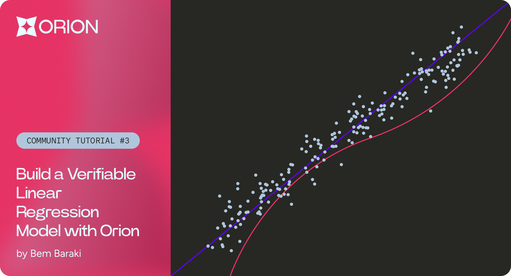

# Verifiable Linear Regression Model

<figure><figcaption></figcaption></figure>

Orion is an open-source framework explicitly designed for the development of Provable Machine Learning models. It achieves this by providing a new ONNX runtime in Cairo to run STARK-provable ML programs.

The following tutorial will be a short guide on how we can utilise the Orion framework to implement our very first fully Verifiable Linear Regression Model in Cairo.

This will enable us to add an extra layer of transparency to our model, ensuring each inference can be verified as well as all the steps executed during the model’s construction phase.

Content overview:

1. [Simple Linear Regression with Python:](verifiable-linear-regression-model-in-orion.md#simple-linear-regression-with-python)Our starting point is a basic implementation of Simple Linear Regression model using the Ordinary Least Squares (OLS) method in Python.
2. [Transitioning to Cairo:](verifiable-linear-regression-model-in-orion.md#transitioning-to-cairo) In the subsequent stage, we will create a new scarb project and replicate our model to Cairo which is a language for creating STARK-provable programs.
3. [Implementing OLS functions using Orion:](verifiable-linear-regression-model-in-orion.md#implementing-ols-functions-using-orion) To catalyse our development process we will utilise the Orion Framework to construct the OLS functions to build our Verifiable Linear Regression model.

### Simple Linear Regression with Python

A Regression model is a foundational technique used to determine the relationship between independent variables (predictors) and dependent variables (outcome). This relationship is typically represented by a straight line and is often termed the “line of best fit”. By mapping how variations in one variable **X** may influence changes in another variable **y**, we can make highly accurate predictions on new unseen data points. The mathematical representation of this linear relationship is given by the equation:

$$
y = a + bX \quad \quad \begin{align*} b & \text{= gradient (slope of the line)} \\ a & \text{= intercept (value of } y \text{ when } X \text{ is zero)} \\ y & \text{= y values} \\ X & \text{= x values} \\ \end{align*}
$$

#### Generating the dataset

In the following [notebook](https://github.com/gizatechxyz/orion\_tutorials/tree/main/basic/verifiable\_linear\_regression\_model), we will create a synthetic dataset that will serve as the backbone throughout our tutorial.

```python
import numpy as np
import os
import matplotlib.pyplot as plt

# Constants for reproducibility
SEED = 42
np.random.seed(SEED)
# Generate 150 values for X and y
X = np.linspace(-0.5, 0.5, 150).astype('float64')
noise = np.random.normal(0, 0.1, len(X)).astype('float64')

## main equation  for generating the dataset
y = 2 * X + 5 + noise # y=2x+5 + noise

plt.scatter(X,y)
plt.xlabel('X values')
plt.ylabel('y values')

```

Upon inspecting the plot, it is readily apparent that there exists a positive correlation between the X and y values, consistent with our underlying equation. Our goal in this tutorial is to quantify this relationship using a regression model, using only the data points provided. By utilizing the Ordinary Least Square (OLS) method, we aim to derive a linear equation that closely approximates the original equation from which the dataset was generated from: `y = 2 * X + 5 + noise`

#### Computing the gradient of the line

OLS method can help us decipher the linear relationship between the X and y variables by calculating the **gradient (beta)** and corresponding **y intercept (a)** to find the optimal "line of best fit".

$$
\text{b} = \frac{\sum (X - \bar{X}) (y - \bar{y})}{\sum (X - \bar{X})^2} \quad \quad \begin{align*} b & \text{= gradient (slope of the line)} \\ \bar{X} & \text{= average of all x values} \\ \bar{y} & \text{= average of all y values} \\ X & \text{= specific x value} \\ y & \text{= specific y value} \\ \sum (X - \bar{X}) (y - \bar{y}) & \text{= covariance between X and y} \\ \sum (X - \bar{X})^2 & \text{= variance of X} \end{align*}
$$

The formula’s numerator quantifies the covariance of X and y, revealing their joint variability. Think of it as an expression to measure how both variables move together. Conversely, the denominator calculates the variance of X, which gauges the distribution of X values around its mean.

By dividing the covariance by the variance of X, we essentially measure the average change in y for a unit change in X. This allows us to capture the strength and direction of the linear relationship between X and y variables. A positive beta value suggests that as X increases, y also tends to increase, and vice versa for negative values. The magnitude of the beta value indicates the sensitivity of y to changes, with respect to changes in X values.

Implementing the formula in Python we get a gradient value of 2.03 which is very close to our original equation of y = 2 \* X + 5 + noise used when generating our synthetic dataset which is a good sign.

```python
numerator = sum((X - X.mean()) * (y - y.mean()))
denominator = sum((X - X.mean())**2)

beta = numerator / denominator
print('The slope of regression line:', beta)
>> The slope of regression line: 2.0133337976122685
```

#### Computing the y-intercept

Having determined the **beta** value, our next step is to calculate the **y-intercept**. This can be achieved by substituting the known **beta**, **y mean**, and **X mean** values into our line equation. The rationale behind using the **y mean** and **X mean** is grounded on the principle that the "line of best fit" must intersect these central points.

$$
a = \bar{y} - b\bar{X} \quad \quad \begin{align*} b & \text{= gradient (slope of the line)} \\ a & \text{= intercept (value of } y \text{ when } X \text{ is zero)} \\ y & \text{= mean y value} \\ X & \text{= mean x values} \\ \end{align*}
$$

```python
intercept = y.mean() - beta * X.mean()
print('The y intercept of our regression line:', intercept)
>> The y intercept of our regression line: 3.916899671448352

plt.scatter(X, y, label='Data Points')
plt.plot(X, beta * X + intercept, color='red', label='Regression Line')
plt.scatter(0.17,predicted_y_value, color='green', label='pred for x = 0.17 ')
plt.xlabel('X')
plt.ylabel('y')
plt.title('Linear Regression')
plt.legend()
plt.grid(True)
plt.show()
print(f"Calculated beta: {beta}")
print(f"Calculated intercept: {intercept}")
>> Calculated beta: 2.0133337976122685
>> Calculated intercept: 4.991767313284746

```

Looking at the above plot we can see we have successfully implemented our Linear regression model and captured the “line of best fit” using the OLS method.

#### Model accuracy

To assess the efficacy of our regression model, we compute the **mse** and **r\_squared\_score** values, which yield an R-squared score of 0.83, indicating a robust predictive performance for the model.

```python
y_pred = beta * X + intercept

mse = np.mean((y - y_pred)**2)
y_mean = np.mean(y)
r_squared = 1 - np.sum((y - y_pred)**2) / np.sum((y - y_mean)**2)


print("Mean Squared Error (MSE):", mse)
print("R-squared (R^2):", r_squared)
>> Mean Squared Error (MSE): 0.008805873341370826
>> R-squared (R^2): 0.974921526753728

```

### Transitioning to Cairo

Now that we have a good understanding of the OLS functions used, we will replicate the full linear regression model in Cairo to turn it to a fully verifiable model. Since we will be rebuilding the model from scratch, this will serve as a good opportunity to get familiar with Orion’s built-in functions and operators making the transition to Cairo seamless.

#### Creating a new scarb project

Scarb is the Cairo package manager specifically created to streamline our Cairo and Starknet development process. Scarb will typically manage project dependencies, the compilation process (both pure Cairo and Starknet contracts), downloading and building external libraries to accelerate our development with Orion.You can find all information about Scarb and Cairo installation here.

To create a new Scarb project, open your terminal and run:

```sh
scarb new verifiable_linear_regression

```

A new project folder will be created for you and make sure to replace the content in Scarb.toml file with the following code:

```toml
[package]
name = "verifiable_linear_regression"
version = "0.1.0"

[dependencies]
orion = { git = "https://github.com/gizatechxyz/orion.git"}

[scripts]
test = "scarb cairo-test -f linear_regression_test"

```

#### Generating the dataset in Cairo

Now let’s generate the files required to begin our transition to Cairo. In our Jupyter Notebook, we will execute the code required to turn our synthetic dataset to fixed point values and represent our X and y values as Fixedpoint Tensors in Orion.

```python
tensor_name =['X_values', 'Y_values']

def generate_cairo_files(data, name):
    
    os.makedirs('src/generated', exist_ok=True)
    with open(os.path.join('src', 'generated', f"{name}.cairo"), "w") as f:
            f.write(
                "use core::array::ArrayTrait;\n" +
                "use orion::operators::tensor::{FP16x16Tensor, TensorTrait, Tensor};\n" +
                "use orion::numbers::{FixedTrait, FP16x16, FP16x16Impl};\n"
                "\nfn {0}() -> Tensor<FixedType>  ".format(name) + "{\n" +
                "    let mut shape = ArrayTrait::new();\n"
            )
            for dim in data.shape:
                f.write("    shape.append({0});\n".format(dim))
            f.write(
                "    let mut data = ArrayTrait::new();\n"
            )
            for val in np.nditer(data.flatten()):
                f.write("    data.append(FixedTrait::new({0}, {1} ));\n".format(abs(int(val * 2**16)), str(val < 0).lower()))
            f.write(
                "let tensor = TensorTrait::<FixedType>::new(shape.span(), data.span()); \n \n" +
                "return tensor;\n\n"+
                "}\n"
            )
    with open(os.path.join('src', 'generated.cairo'), 'w') as f:
        for param_name in tensor_name:
            f.write(f"mod {param_name};\n")
```

The X\_values and y\_values tensor values will now be generated under `src/generated` directory.

In `src/lib.cairo` replace the content with the following code:

```rust
mod generated;
mod test;
mod lin_reg_func;
```

This will tell our compiler to include the separate modules listed above during the compilation of our code. We will be covering each module in detail in the following section, but let’s first review the generated folder files.

```rust
use core::array::ArrayTrait;
use orion::operators::tensor::{FP16x16Tensor, TensorTrait, Tensor};
use orion::numbers::{FixedTrait, FP16x16, FP16x16Impl};

fn X_values() -> Tensor<FP16x16> {
    let mut shape = ArrayTrait::new();
    shape.append(150);
    let mut data = ArrayTrait::new();
    data.append(FixedTrait::new(32768, true));
    data.append(FixedTrait::new(32328, true));
    // data has been truncated (only showing the first and last 2 values out of the 150 values)
    data.append(FixedTrait::new(32328, false));
    data.append(FixedTrait::new(32768, false));
    let tensor = TensorTrait::<FP16x16>::new(shape.span(), data.span());

    return tensor;
}
```

Since Cairo does not come with built-in signed integers we have to explicitly define it for our X and y values. Luckily, this is already implemented in Orion for us as a struct as shown below:

```rust
// Example of a FP16x16.
struct FP16x16 {
    mag: u32,
    sign: bool
}

```

For this tutorial, we will use FP16x16 numbers where the magnitude represents the absolute value and the boolean indicates whether the number is negative or positive. To replicate the OLS functions, we will conduct our operations using FP16x16 Tensors which are also represented as a structs in Orion.

```rust
struct Tensor<T> {
    shape: Span<usize>,
    data: Span<T>
}
```

A `Tensor` in Orion takes a shape and a span array of the data. We work with a `Tensor<FP16x16>`. In a 16x16 fixed-point format, there are 16 bits dedicated to the integer part of the number and 16 bits for the fractional part of the number. This format allows us to work with a wide range of values and a high degree of precision for conducting the OLS Tensor operations.

### Implementing OLS functions using Orion

At this stage, we will be reproducing the OLS functions now that we have generated our X and Y fixed point Tensors. We will begin by creating a separate file for our linear regression functions file named `lin_reg_func.cairo` to host all of our linear regression functions.

#### Computing the mean

```rust
/// Calculates the mean of a given 1D tensor.
fn calculate_mean(tensor_data: Tensor<FP16x16>) -> FP16x16 {
    let tensor_size = FixedTrait::<FP16x16>::new_unscaled(tensor_data.data.len(), false);

    let cumulated_sum = tensor_data.cumsum(0, Option::None(()), Option::None(()));
    let sum_result = cumulated_sum.data[tensor_data.data.len() - 1];
    let mean = *sum_result / tensor_size;

    return mean;
}
```

The above function takes in an FP16x16 Tensor and computes its corresponding mean value. We break the steps down by first calculating the cumulative sum of the tensor values using the `cumsum` built-in orion operator. We then divide the result by the length of the tensor size and return the output as a fixed point number.

#### Computing the deviation from the mean

```rust
/// Calculates the deviation of each element from the mean of the provided 1D tensor.
fn deviation_from_mean(tensor_data: Tensor<FP16x16>) -> Tensor<FP16x16> {
    let mean_value = calculate_mean(tensor_data);

    let mut tensor_shape = array::ArrayTrait::new();
    tensor_shape.append(tensor_data.data.len());

    let mut deviation_values = array::ArrayTrait::new();

    let mut i: u32 = 0;
    loop {
        if i >= tensor_data.data.len() {
            break ();
        }
        let distance_from_mean = *tensor_data.data.at(i) - mean_value;
        deviation_values.append(distance_from_mean);
        i += 1;
    };

    let distance_from_mean_tensor = TensorTrait::<FP16x16>::new(
        tensor_shape.span(), deviation_values.span()
    );

    return distance_from_mean_tensor;
}
```

The following deviation\_from\_mean function calculates the deviation from the mean for each element of a given tensor. We initially calculate the tensor's mean value and store it under the variable mean\_value. We then create a for loop to iterate over each element in the tensor values and calculate the deviation from the mean which we will append the result to `deviation_values` array. Finally, we create a new tensor named distance\_from\_mean\_tensor by passing the deviation\_values array and the tensor shape.

#### Computing the gradient value

The OLS gradient (beta) formula:

$$
\text{b} = \frac{\sum (X - \bar{X}) (y - \bar{y})}{\sum (X - \bar{X})^2}
$$

```rust
/// Calculates the beta value for linear regression.
fn compute_beta(x_values: Tensor<FP16x16>, y_values: Tensor<FP16x16>) -> FP16x16 {
    let x_deviation = deviation_from_mean(x_values);
    let y_deviation = deviation_from_mean(y_values);

    let x_y_covariance = x_deviation.matmul(@y_deviation);
    let x_variance = x_deviation.matmul(@x_deviation);

    let beta_value = *x_y_covariance.data.at(0) / *x_variance.data.at(0);

    return beta_value;
}
```

We can now compute the beta value for our linear regression utilising the previous deviation\_from\_mean function. We first calculate both the deviation of x values and y values from the mean and store them in separate variables as tensors. To calculate the covariance, we use the built-in Orion `matmul` operator to multiply x\_deviation by y\_deviation tensors. Similarly, we compute the X variance by multiplying x\_deviation tensor by itself. Finally, we divide the `x_y_covariance` by the `x_variance` to get an approximate gradient value for our regression model.

#### Computing the y-intercept

```rust
/// Calculates the intercept for linear regression.
fn compute_intercept(
    beta_value: FP16x16, x_values: Tensor<FP16x16>, y_values: Tensor<FP16x16>
) -> FP16x16 {
    let x_mean = calculate_mean(x_values);
    let y_mean = calculate_mean(y_values);

    let mx = beta_value * x_mean;
    let intercept = y_mean - mx;

    return intercept;
}
```

Calculating the y-intercept is fairly simple, we just need to substitute the calculated beta, y\_mean and x\_mean values and rearrange for the intercept value as previously shown in the Python implementation section.

#### Testing the model

Now that we have implemented all the necessary functions for the OLS method, we can finally test our linear regression model. We begin by creating a new separate test file named `test.cairo` and import all the necessary Orion libraries including our `X_values` and `y_values` found in the generated folder. We also import all the OLS functions from `lin_reg_func.cairo` file as we will be relying upon them to construct the regression model.

```rust
use core::debug::PrintTrait;

use verifiable_linear_regression::generated::X_values::X_values;
use verifiable_linear_regression::generated::Y_values::Y_values;
use verifiable_linear_regression::lin_reg_func::{
    calculate_mean, deviation_from_mean, compute_beta, compute_intercept, predict_y_values,
    compute_mse, calculate_r_score
};


#[test]
#[available_gas(99999999999999999)]
fn linear_regression_test() {
    // Fetching the x and y values
    let y_values = Y_values();
    let x_values = X_values();

    // (*x_values.data.at(18)).print();

    let beta_value = compute_beta(x_values, y_values);
    // beta_value.print();    // calculated gradient value

    let intercept_value = compute_intercept(beta_value, x_values, y_values);
    // intercept_value.print();   // calculated intercept value

    let y_pred = predict_y_values(beta_value, x_values, y_values);

    let mse = compute_mse(y_values, y_pred);
    // mse.print();       // mean squared error ouput

    let r_score = calculate_r_score(y_values, y_pred);
    r_score.print(); // accuracy of model around 0.97494506835

    assert(beta_value.mag > 0, 'x & y not positively correlated');
    assert(r_score.mag > 0, 'R-Squared needs to be above 0');
    assert(
        r_score.mag < 65536, 'R-Squared has to be below 65536'
    ); // 65536 represents ONE in fp16x16.
    assert(r_score.mag > 32768, 'Accuracy below 50% ');
}
```

Our model will get tested under the `linear_regression_test()` function which will follow the following steps:

1. Data Retrieval: The function initiates by fetching the dependent X and y values sourced from the generated folder.
2. Beta Calculation: With the data on board, it proceeds to determine the gradient (beta\_value) of the linear regression line using the compute\_beta function.
3. Intercept Calculation: The y-intercept (intercept\_value) of the regression line is calculated using utilising the previously calculated beta value.
4. Prediction Phase: At this stage, we have all the components needed for our linear regression model. We make new predictions using our X values to see how well it generalises.
5. Evaluation: The main part of the function is dedicated to model evaluation. It calculates the Mean Squared Error (mse), a measure of the average squared difference between the observed actual outcomes and the outcomes predicted by the model (between y\_pred and y\_values). It also calculates the R-squared value (r\_score) which measures the accuracy of the model between the values of 0-1.
6. The test function will also perform basic checks making sure our beta value is positive, the R-squared value is between 0-1 and our model accuracy is above 50%.

Finally, we can execute the test file by running `scarb cairo-test -f linear_regression_test`

```shell
scarb cairo-test -f linear_regression_test 
testing verifiable_linear_regression ...
running 1 tests

test verifiable_linear_regression::test::linear_regression_test ... ok
test result: ok. 1 passed; 0 failed; 0 ignored; 0 filtered out;
```

And as we can our test cases have passed! :confetti\_ball:

If you've made it this far, well done! :clap: You are now capable of building verifiable ML models, making them ever more reliable and transparent than ever before.

We invite the community to join us in forging a future in making AI transparent and reliable resource for all.
