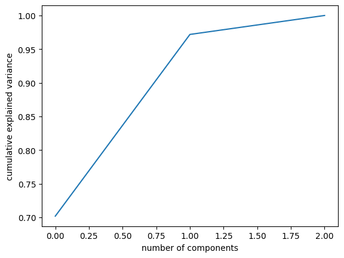
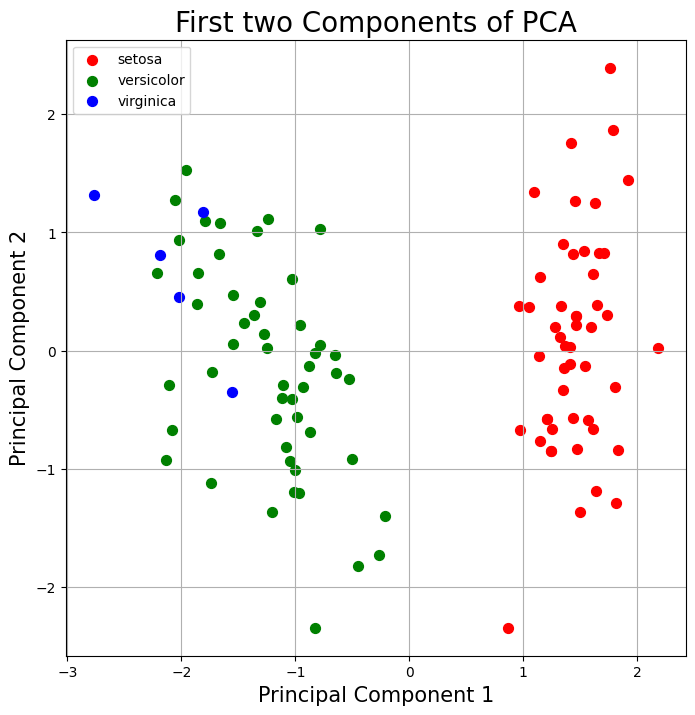

# Verifiable Principal Components Analysis

<figure><figcaption></figcaption></figure>

## **Verifiable Principal Components Analysis**

The Principal Component Analysis (PCA) method is an unsupervised learning algorithm that aims to reduce the dimensionality of a dataset consisting of a large number of interrelated variables, while at the same time preserving as much of the variation present in the original dataset as possible. This is achieved by transforming to a new set of variables, the principal components (PC), which are uncorrelated and are ordered in such a way that the first ones retain most of the variation present in all the original variables. More formally, with PCA, given $$n$$ observations of $$p$$ variables, it seeks the possibility of adequately representing this information with a smaller number of variables, constructed as linear combinations of the original variables.

Below, we provide a brief review of the implementation of a Principal Component Analysis (PCA) in Python, which we will then convert to Cairo to transform it into a verifiable ZKML (Principal Component Analysis), using the Orion library. This provides an opportunity to become familiar with the main functions and operators that the framework offers for the implementation of PCA.

Content overview:

1. [Principal Components Analysis with Python](verifiable-principal-components-analysis.md#used-dataset): We start with the basic implementation of PCA using correlation matrix in Python.
2. [Convert your model to Cairo](verifiable-principal-components-analysis.md#convert-your-model-to-cairo): In the subsequent stage, we will create a new scarb project and replicate our model to Cairo which is a language for creating STARK-provable programs.
3. [Implementing PCA model using Orion](verifiable-principal-components-analysis.md#implementing-pca-using-orion): To catalyze our development process, we will use the Orion Framework to construct the key functions to build our verifiable PCA.

#### Used DataSet

For the purposes of this tutorial, we will use the iris dataset from sklearn.datasets.

```python
import numpy as np
import math
import matplotlib.pyplot as plt
import pandas as pd
from sklearn.datasets import load_iris

data = load_iris()
X = data['data']

y = data['target']

```

For the purposes of this tutorial, we will not take into account the total number of records in the original dataset. In this sense, we will only focus on the first 105 individuals and the first 3 variables, in order to have comparable results between the python and cairo implementations, taking into consideration the same number of iterations in both programs to achieve orthogonality between the components at the computational level. Therefore, we will have the total number of individuals of the species versicolor and virginica, partially the individuals of the species setosa and with the exclusion of the variable petal width.

```python
X, y = X[:105,0:3], y[:105]
```

Before applying PCA, it is important to standardize the data. This ensures that each feature has an equal weight in the calculation of principal components.

```python
sigma = np.std(X, axis=0)
mu = np.mean(X, axis=0)
X_std = (X - mu)/sigma

```

#### Implementation of the Jacobi algorithm

The Jacobi algorithm is an iterative method for finding the eigenvalues and eigenvectors of a symmetric matrix, which in our case is the correlation matrix over $$\mathbf{X_{std}}$$. With this method, the aim is to identify pairs of elements off the main diagonal of the matrix and "rotate" them to zero using orthogonal transformations. The idea is that, after enough rotations, the matrix will converge to a diagonal matrix whose diagonal elements will be the eigenvalues of the original matrix. The eigenvectors, on the other hand, are constructed from the rotation matrices applied during the process.

```python
def extract_diagonal(matrix):
    return [matrix[i][i] for i in range(len(matrix))]
```

```python
def find_max_off_diag(A):
    n = A.shape[0]
    p, q = 0, 1
    max_val = abs(A[p, q])
    for i in range(n-1):
        for j in range(i+1, n):
            if abs(A[i, j]) > max_val:
                max_val = abs(A[i, j])
                p, q = i, j
    return p, q

def jacobi_eigensystem(A, tol=1e-2, max_iter=500): 
    if len(A.shape) != 2 or A.shape[0] != A.shape[1]:
        raise ValueError("A must be a square matrix")
    
    n = A.shape[0]
    V = np.eye(n)

    for _ in range(max_iter):
        p, q = find_max_off_diag(A)
        
        if abs(A[p, q]) < tol:
            break
        
        if A[p, p] == A[q, q]:
            theta = math.pi/4
        else:
            theta = 0.5 * math.atan(2 * A[p, q] / (A[p, p] - A[q, q]))
        
        J = np.eye(n)
        J[p, p], J[q, q] = math.cos(theta), math.cos(theta)
        J[p, q], J[q, p] = math.sin(theta), -math.sin(theta)
        
        A = np.matmul(np.matmul(J.T,A),J)
        V = np.matmul(V,J)

    return extract_diagonal(A), V
```

#### Correlation Matrix

At this point, we determine the correlation matrix, based on the calculations of the variance and covariance matrix for $$\mathbf{X_{std}}$$.

We compute the covariance matrix

$$\mathbf{S}  = \mathbf{X}^{T} \mathbf{X} /\mathbf{n-1}$$

Then, we determine the correlation matrix :

$$\mathbf{r} = \mathbf{Cov(X,Y)} /\mathbf{S_{X} S_{Y}}$$,

where $$\mathbf{S_{X} S_{Y}}$$ are the standard deviations of X and Y respectively.

```python
n = (X_std.shape[0]-1) 
cov_matrix = np.dot(X_std.T,X_std)/n 
stddevs = np.sqrt(extract_diagonal(cov_matrix))

>> array([[ 1.00961538, -0.20656485,  0.83469099],
          [-0.20656485,  1.00961538, -0.57369635],
          [ 0.83469099, -0.57369635,  1.00961538]])
```

```python
corr_matrix = cov_matrix / (stddevs.reshape(-1, 1)@stddevs.reshape(1, -1))

corr_matrix
>> array([[ 1.        , -0.20459756,  0.82674155],
          [-0.20459756,  1.        , -0.56823258],
          [ 0.82674155, -0.56823258,  1.        ]])
```

```python
evalu, evec = jacobi_eigensystem(corr_matrix)
```

At this point, we have the eigenvalues and eigenvectors associated with the correlation matrix. Now, we sort the eigenvalues in decreasing order, as the largest of these will be associated with the component that explains the most variability in the data. Consequently, the principal components will be sorted in the same order as the eigenvalues and eigenvectors.

```python
idx = np.argsort(evalu)[::-1]
evec = evec[:,idx]
evalu = evalu[idx]
```

```python
evalu, evec

>> (array([2.10545934, 0.81005256, 0.0844881 ]),
    array([[-0.58699831,  0.55819468, -0.58638867],
           [ 0.45714577,  0.82631669,  0.32896575],
           [-0.66816968,  0.07496276,  0.74022284]]))
```

### Loadings PCA

Once the aforementioned order is established, we find the loadings which are represented by the discovered eigenvectors (evec). These loadings represent the coefficients of each variable in each of the principal components.

```python
loadings = pd.DataFrame(evec,columns=['PC1','PC2','PC3'], index = data['feature_names'][:3])
loadings

>> 	                    PC1	      PC2	       PC3
  sepal length (cm)	-0.586998	0.558195	-0.586389
  sepal width (cm)	 0.457146	0.826317	 0.328966
  petal length (cm)	-0.668170	0.074963	 0.740223
```

### New axis, Principal Components

Next, we identify the new axes or principal components, which are obtained as a linear combination of the standardized original variables.

$$\mathbf{PC_{i}} = \mathbf{a_{i1}X_1} + \mathbf{a_{i2}X_2} + \mathbf{...} + \mathbf{a_{in}X_n}$$,

Where,

$$\mathbf{X_1}, \mathbf{X_2}, \mathbf{...} + \mathbf{X_n}$$ are the standardized original variables.

$$\mathbf{a_{i1}}, \mathbf{a_{i2}}, \mathbf{...} + \mathbf{a_{in}}$$are the coefficients or loadings of the $$\mathbf{i-th}$$ eigenvector.

```python
principalDf = pd.DataFrame(np.dot(X_std,loadings))
principalDf.columns = ["principal component {}".format(i+1) for i in range(principalDf.shape[1])]
principalDf

>> 		principal component 1	principal component 2	principal component 3
0	         1.462774	                0.289653	        -0.115854
1	         1.151659	               -0.763285	        -0.290054
2	         1.568707	               -0.583768	        -0.019975
3       	 1.472596	               -0.835303	         0.095131
4	         1.649487	                0.381858	         0.043347
                ...	                       ...	                ...	...
100	        -1.806412	                1.175944	         0.900363
101	        -1.555969	               -0.351478	         0.487362
102	        -2.767543	                1.317228	        -0.069714
103	        -2.023098	                0.449313	         0.425579
104	        -2.190391	                0.804982	         0.414940
105 rows × 3 columns
```

Next, we validate the orthogonality between the principal components, as we observe the lack of correlation between these new variables (Principal Components).

```python
n = principalDf.shape[0] - 1
cov_new = np.dot(np.array(principalDf).T,np.array(principalDf))/n 
stddevs = np.sqrt(extract_diagonal(cov_new))
corr_new = cov_new / np.matmul(stddevs.reshape(-1, 1),stddevs.reshape(1, -1))
```

```python
corr_new
>>   array([[ 1.        , -0.002632  , -0.01975951],
            [-0.002632  ,  1.        ,  0.0200618 ],
            [-0.01975951,  0.0200618 ,  1.        ]])
```

```python
new_corr = round(abs(pd.DataFrame(corr_new)))
new_corr

>>   	0	  1	     2
0	   1.0	 0.0	0.0
1	   0.0	 1.0	0.0
2	   0.0	 0.0	1.0
```

The implementation of Jacobi in Python is carried out considering 500 iterations, in order to optimize its implementation at the Cairo level. That is why rounding is applied when checking for orthogonality.

### Selection of the number of components to be retained

Each principal component accounts for a proportion of the total variance, and such proportion can be determined by the ratio of each eigenvalue to the total sum of all eigenvalues. Thus, the percentage of variance explained by the i-th component is given by:

$$\frac{\lambda_i}{\sum_{j=1}^{p} \lambda_j}$$

```python
plt.plot(np.cumsum(evalu)/np.sum(evalu))
plt.xlabel('number of components')
plt.ylabel('cumulative explained variance');
```

<figure><figcaption></figcaption></figure>

```python
select_pc = round(((evalu)/np.sum(evalu))[:2].sum(),2)*100
select_pc

>> 97.0
```

As observed in the previous graph, we decided to keep the **first 2 components**, which explain **97%** of the total variability of the data.

```python
fig = plt.figure(figsize = (8,8))
ax = fig.add_subplot(1,1,1) 
ax.set_xlabel('Principal Component 1', fontsize = 15)
ax.set_ylabel('Principal Component 2', fontsize = 15)
ax.set_title('First two Components of PCA', fontsize = 20)

targets = [0, 1, 2]
names = ['setosa', 'versicolor','virginica']
colors = ['r', 'g', 'b'] 
for target, color, name in zip(targets, colors, names):
    indicesToKeep = y == target
    ax.scatter(principalDf.loc[indicesToKeep, 'principal component 1']
               , principalDf.loc[indicesToKeep, 'principal component 2']
               , c = color
               , s = 50)
ax.legend(names)
ax.grid()
```


<figure><figcaption></figcaption></figure>

Based on what is observed in the graph of the first 2 principal components, we notice how the setosa species differentiates from the versicolor and virginica species in principal component 1, which is attributed to the variables petal length (cm), and sepal length (cm).

Among its other applications, here we were able to use PCA to describe a dataset in a dimension smaller than that of the original dataset. As previously discussed, we noticed how we can describe interesting aspects of the original data without the need to address separately all the dimensions of such data.

### Convert your model to Cairo

Now that we have a good understanding of the PCA algorithm and their key functions, we will replicate the entire algorithm in Cairo to make it fully verifiable. Since we will be rebuilding the algorithm from scratch, this will be a good opportunity to get acquainted with Orion's built-in functions and the operators that make the transition to Cairo seamless.

#### Create a new Scarb project

Scarb is the Cairo package manager specifically created to streamline our Cairo and Starknet development process. Scarb will typically manage project dependencies, the compilation process (both pure Cairo and Starknet contracts), downloading and building external libraries to accelerate our development with Orion.You can find all information about Scarb and Cairo installation [here](https://orion.gizatech.xyz/v/develop/framework/get-started#installations).

To create a new Scarb project, open your terminal and run:

```
scarb new verifiable_principal_component_analysis
```

A new project folder will be created for you and make sure to replace the content in Scarb.toml file with the following code:

```toml
[package]
name = "scarb new verifiable_principal_components_analysis"
version = "0.1.0"

[dependencies]
orion = { git = "https://github.com/gizatechxyz/orion.git", rev = "v0.1.7" }
```

#### Gerating the dataset in Cairo

Now let's generate the necessary files to begin our transition to Cairo. In our Jupyter Notebook, we will run the necessary code to convert our iris dataset obtained from sklearn.datasets into fixed point values and represent our X, and y values as fixed point tensors in Orion. For the purposes of the tutorial, we will work directly with the Xstd data obtained from python, so we will also convert these to fixed point values.

```python
import os
```

```python
os.makedirs("src/generated", exist_ok=True)
```

```python
tensor_name = ["X","X_std","y"]

def generate_cairo_files(data, name):

    with open(os.path.join('src', 'generated', f"{name}.cairo"), "w") as f:
        f.write(
            "use array::{ArrayTrait, SpanTrait};\n" +
            "use orion::operators::tensor::{core::{Tensor, TensorTrait}};\n" +
            "use orion::operators::tensor::FP16x16Tensor;\n" +
            "use orion::numbers::fixed_point::implementations::fp16x16::core::{FP16x16, FixedTrait};\n" +
            "\n" + f"fn {name}() -> Tensor<FP16x16>" + "{\n\n" + 
            "let mut shape = ArrayTrait::new();\n"
        )
        for dim in data.shape:
            f.write(f"shape.append({dim});\n")
    
        f.write("let mut data = ArrayTrait::new();\n")
        for val in np.nditer(data.flatten()):
            f.write(f"data.append(FixedTrait::new({abs(int(decimal_to_fp16x16(val)))}, {str(val < 0).lower()}));\n")
        f.write(
            "let tensor = TensorTrait::<FP16x16>::new(shape.span(), data.span());\n" +
            "return tensor;\n}"
        )

with open(f"src/generated.cairo", "w") as f:
    for n in tensor_name:
        f.write(f"mod {n};\n")

generate_cairo_files(X, "X")
generate_cairo_files(X_std, "X_std")
generate_cairo_files(y, "y")
```

The X, X\_std and y tensor values will now be generated under `src/generated` directory.

In `src/lib.cairo` replace the content with the following code:

```rust
mod generated;
mod helper;
mod test;
```

This will tell our compiler to include the separate modules listed above during the compilation of our code. We will be covering each module in detail in the following section, but let’s first review the generated folder files.

```rust
use array::{ArrayTrait, SpanTrait};
use orion::operators::tensor::{core::{Tensor, TensorTrait}};
use orion::operators::tensor::FP16x16Tensor;
use orion::numbers::fixed_point::implementations::fp16x16::core::{FP16x16, FixedTrait};

fn X_std() -> Tensor<FP16x16> {
    let mut shape = ArrayTrait::new();
    shape.append(105);
    shape.append(3);
    let mut data = ArrayTrait::new();

    // data has been truncated (only showing the first 5 values out of the 100 values) modif datos

    data.append(FixedTrait::new(41223, true));
    data.append(FixedTrait::new(57011, false));
    data.append(FixedTrait::new(68250, true));
    data.append(FixedTrait::new(61079, true));
    data.append(FixedTrait::new(13084, true));
    let tensor = TensorTrait::<FP16x16>::new(shape.span(), data.span());
    return tensor;
}
```

Since Cairo does not come with built-in fixed points we have to explicitly define it for our X, y and Xstd values. Luckily, this is already implemented in Orion for us as a struct as shown below:

```rust
// Example of a FP16x16.
struct FP16x16 {
    mag: u32,
    sign: bool
}
```

For this tutorial, we will use fixed point numbers FP16x16 where the magnitude represents the absolute value and the boolean indicates whether the number is negative or positive. In a 16x16 fixed-point format, there are 16 bits dedicated to the integer part of the number and 16 bits for the fractional part of the number. This format allows us to work with a wide range of values and a high degree of precision for conducting the Tensor operations. To replicate the key functions of PCA, we will conduct our operations using FP16x16 Tensors which are also represented as a structs in Orion.

```rust
struct Tensor<T> {
    shape: Span<usize>,
    data: Span<T>
}
```

A `Tensor` in Orion takes a shape and a span array of the data.

### Implementing PCA using Orion

At this stage, we will be reproducing the Principal component analysis functions now that we have generated our X, y and Xstd Fixedpoint Tensors. We will begin by creating a separate file for our PCA functions file named `helper.cairo` to host all of our core functions.

#### PCA Core functions

```rust
use traits::TryInto;
use alexandria_data_structures::array_ext::{SpanTraitExt};
use array::{ArrayTrait, SpanTrait};
use orion::operators::tensor::{Tensor, TensorTrait};
use orion::numbers::fixed_point::{core::{FixedTrait}};

use orion::operators::tensor::{FP16x16Tensor, FP16x16TensorDiv};
use orion::numbers::fixed_point::implementations::fp16x16::core::{
    FP16x16, FP16x16Impl, FP16x16Add, FP16x16AddEq, FP16x16Sub, FP16x16Mul, FP16x16MulEq,
    FP16x16TryIntoU128, FP16x16PartialEq, FP16x16PartialOrd, FP16x16SubEq, FP16x16Neg, FP16x16Div,
    FP16x16IntoFelt252, FP16x16Print, HALF
};

use orion::numbers::fixed_point::implementations::fp16x16::math::trig;

#[derive(Copy, Drop)]
struct EigenValues<FP16x16> {
    p_index: usize,
    q_index: usize,
    theta: FP16x16,
}

fn div_by_scalar(self: @Tensor<FP16x16>, divisor: u32) -> Tensor<FP16x16> {
    let mut data = (*self).data;
    let mut data_array = ArrayTrait::new();

    loop {
        match data.pop_front() {
            Option::Some(elem) => {
                data_array.append(FixedTrait::new(*elem.mag / divisor, *elem.sign));
            },
            Option::None(_) => {
                break TensorTrait::<FP16x16>::new((*self).shape, data_array.span());
            }
        };
    }
}

fn div_by_fp(self: @Tensor<FP16x16>, divisor: FP16x16) -> Tensor<FP16x16> {
    let mut data = (*self).data;
    let mut data_array = ArrayTrait::new();

    loop {
        match data.pop_front() {
            Option::Some(elem) => { data_array.append(FP16x16Div::div(*elem, divisor)); },
            Option::None(_) => {
                break TensorTrait::<FP16x16>::new((*self).shape, data_array.span());
            }
        };
    }
}

// find_max_off_diag: Finds the maximum off-diagonal element in a square Tensor.
fn find_max_off_diag(a: @Tensor<FP16x16>) -> (usize, usize) {
    let mut data = *a.data;
    let mut shape = *a.shape;

    let n = *(*a).shape.at(0);

    let mut i = 0_usize;
    let mut j = 0_usize;
    let mut p = 0_usize;
    let mut q = 1_usize;

    let mut max_val = FixedTrait::abs((*a).at(indices: array![p, q].span()));

    loop {
        if i == n {
            break (p, q);
        };

        j = i + 1;

        loop {
            if j == n {
                break;
            };
            if FixedTrait::abs((a).at(indices: array![i, j].span())) > max_val {
                max_val = FixedTrait::abs((a).at(indices: array![i, j].span()));
                p = i;
                q = j;
            };
            j += 1;
        };
        i += 1;
    }
}

// jacobi_eigensystem: Implements the Jacobi eigenvalue algorithm to compute the eigenvalues and eigenvectors of a symmetric Tensor.
fn jacobi_eigensystem(
    mut a: Tensor<FP16x16>, tol: FP16x16, max_iter: usize
) -> (Tensor<FP16x16>, Tensor<FP16x16>) {
    assert(
        !((a).shape.len() != 2_usize || ((a).shape.at(0_usize) != (a).shape.at(1_usize))),
        'a must be a square matrix'
    );

    // let two = FixedTrait::new(ONE, false) + FixedTrait::new(ONE, false);
    let two = FixedTrait::ONE() + FixedTrait::ONE();
    let four = two * two;
    let half = FixedTrait::<FP16x16>::new(HALF, false);
    let pi = FixedTrait::<FP16x16>::new(trig::PI, false);

    let mut data = a.data;
    let mut shape = a.shape;
    let numRows = *((shape).at(0));
    let mut v = eye(numRows: numRows);

    let mut i: usize = 0;

    loop {
        let (p, q) = find_max_off_diag(@a);

        if i == max_iter || FixedTrait::abs((a).at(indices: array![p, q].span())) < tol {
            break (extract_diagonal(@a), v);
        };

        let theta = if (a)
            .at(indices: array![p, p].span()) == (a)
            .at(indices: array![q, q].span()) {
            FP16x16Div::div(pi, four)
        } else {
            half
                * trig::atan(
                    FP16x16Div::div(
                        two * (a).at(indices: array![p, q].span()),
                        (FP16x16Sub::sub(
                            (a).at(indices: array![p, p].span()),
                            (a).at(indices: array![q, q].span())
                        ))
                    )
                )
        };

        let eigensystem = EigenValues { p_index: p, q_index: q, theta: theta };

        let j_eye = eye(numRows: numRows);

        let j = update_eigen_values(self: @j_eye, eigensystem: eigensystem);

        let transpose_j = j.transpose(axes: array![1, 0].span());
        a = transpose_j.matmul(@a).matmul(@j);

        v = v.matmul(@j);

        i += 1;
    }
}

// eye: Generates an identity Tensor of the specified size
fn eye(numRows: usize) -> Tensor<FP16x16> {
    let mut data_array = ArrayTrait::new();

    let mut x: usize = 0;

    loop {
        if x == numRows {
            break;
        };

        let mut y: usize = 0;

        loop {
            if y == numRows {
                break;
            };

            if x == y {
                data_array.append(FixedTrait::ONE());
            } else {
                data_array.append(FixedTrait::ZERO());
            };

            y += 1;
        };
        x += 1;
    };

    Tensor::<FP16x16> { shape: array![numRows, numRows].span(), data: data_array.span() }
}

// extract_diagonal: Extracts the diagonal elements from a square tensor
fn extract_diagonal(self: @Tensor<FP16x16>) -> Tensor<FP16x16> {
    let mut data = (*self).data;
    let mut data_array = ArrayTrait::new();

    let dims = (*self).shape.at(0);

    let mut x: usize = 0;

    loop {
        if x == *dims {
            break;
        };

        let mut y: usize = 0;

        loop {
            if y == *dims {
                break;
            };

            match data.pop_front() {
                Option::Some(elem) => { if x == y {
                    data_array.append(*elem);
                }; },
                Option::None(_) => { break; }
            };
            y += 1;
        };
        x += 1;
    };

    Tensor::<FP16x16> { shape: array![*dims].span(), data: data_array.span() }
}

// update_eigen_values: Updates the eigenvalues of a symmetric tensor
fn update_eigen_values(
    self: @Tensor<FP16x16>, eigensystem: EigenValues<FP16x16>
) -> Tensor<FP16x16> {
    let mut data = (*self).data;
    let mut data_array = ArrayTrait::new();

    let mut x: usize = 0;
    let mut y: usize = 0;
    let mut index: usize = 0;
    let dims = (*self).shape.at(0);
    let items = *dims * *dims;
    let dims_y = (*self).shape.at(1);

    loop {
        if index == items {
            break;
        };

        if y == *dims_y {
            x += 1;
            y = 0;
        };

        match data.pop_front() {
            Option::Some(elem) => {
                let eigen_values = eigensystem;

                let value = if (eigen_values.p_index, eigen_values.p_index) == (x, y) {
                    trig::cos(eigen_values.theta)
                } else if (eigen_values.q_index, eigen_values.q_index) == (x, y) {
                    trig::cos(eigen_values.theta)
                } else if (eigen_values.p_index, eigen_values.q_index) == (x, y) {
                    trig::sin(eigen_values.theta)
                } else if (eigen_values.q_index, eigen_values.p_index) == (x, y) {
                    trig::sin(-eigen_values.theta)
                } else {
                    *elem
                };

                data_array.append(value);
                y += 1;
                index += 1;
            },
            Option::None(_) => { break; }
        };
    };

    Tensor::<FP16x16> { shape: *self.shape, data: data_array.span() }
}

// check_unit_diagonal_tensor: Checks whether a square tensor has a unit diagonal
fn check_unit_diagonal_tensor(self: @Tensor<FP16x16>) -> bool {
    let mut x: usize = 0;
    let mut valid: bool = true;
    let dim_x = (*self).shape.at(0);
    let dim_y = (*self).shape.at(1);

    loop {
        if x == *dim_x || !valid {
            break valid;
        };

        let mut y: usize = 0;

        loop {
            if y == *dim_y {
                break;
            };

            if x == y {
                if (self).at(indices: array![x, y].span()) != FixedTrait::ONE() {
                    valid = false;
                    break;
                }
            } else {
                if (self).at(indices: array![x, y].span()) != FixedTrait::ZERO() {
                    valid = false;
                    break;
                }
            };

            y += 1;
        };
        x += 1;
    }
}
```

####

For the purposes of this tutorial, we will apply sorting to the tensors evec and evalu obtained from the execution of our Cairo jacobi\_eigensystem function using the functions provided by NumPy for this purpose, generating the evalu\_sort.cairo and evec\_sort.cairo files

```python
evalu_from_cairo = np.array([52513, 137534, 5393])
evec_from_cairo = np.array([
    [36422, -38024, -38467],
    [53777, 30012, 21440],
    [5195, -43789, 48143]
])
idx = np.argsort(evalu_from_cairo)[::-1]
evec_ord = evec_from_cairo[:,idx]
evalu_ord = np.sort(evalu_from_cairo)[::-1]
>>
[137534  52513   5393]
[[-38024  36422 -38467]
[ 30012  53777  21440]
[-43789   5195  48143]]
```

#### Testing the model

Now that we have implemented all the necessary functions for PCA, we can finally test our dimensionality reduction algorithm. We begin by creating a new separate test file named `test.cairo` and import all the necessary Orion libraries, including our X values and y and Xstd values found in the generated folder. We also import all the key functions for PCA from the `helper.cairo` file, as we will rely on them to construct the model.

```rust
#[cfg(test)]
mod tests {
    use traits::TryInto;
    use alexandria_data_structures::array_ext::{SpanTraitExt};
    use array::{ArrayTrait, SpanTrait};
    use orion::operators::tensor::{Tensor, TensorTrait};
    use orion::numbers::fixed_point::{core::{FixedTrait}};

    use orion::operators::tensor::{FP16x16Tensor, FP16x16TensorDiv, FP16x16TensorSub};

    use orion::numbers::fixed_point::implementations::fp16x16::core::{
        FP16x16, FP16x16Impl, FP16x16Add, FP16x16AddEq, FP16x16Sub, FP16x16Mul,
        FP16x16MulEq, FP16x16TryIntoU128, FP16x16PartialEq, FP16x16PartialOrd, FP16x16SubEq,
        FP16x16Neg, FP16x16Div, FP16x16IntoFelt252, FP16x16Print, FP16x16TryIntoU32
    };

    use pca::{
        helper::{
            EigenValues, extract_diagonal, eye, find_max_off_diag, jacobi_eigensystem,
            update_eigen_values, check_unit_diagonal_tensor, div_by_scalar, div_by_fp
        }
    };

    use pca::{generated::{X_std::X_std, X::X, y::y, evalu_sort::evalu_sort, evec_sort::evec_sort}};

    #[test]
    #[available_gas(99999999999999999)]
    fn pca_test() {
        let tol = FixedTrait::<FP16x16>::new(655, false); // 655 is 0.01 = 1e-2
        let max_iter = 500_usize;

        let X_std = X_std();
        let X = X();
        let y = y();

        let mut n: usize = *((X_std).shape.at(0)) - 1;
        let size = *(X_std.shape.at(1));

        let X_std_transpose = X_std.transpose(axes: array![1, 0].span());
        let mut cov_matrix = div_by_scalar(@(X_std_transpose.matmul(@X_std)), n);

        let mut stddevs = extract_diagonal(@cov_matrix).sqrt();

        let mut stddevs_left = stddevs.reshape(array![size, 1].span());
        let mut stddevs_right = stddevs.reshape(array![1, size].span());
        let corr_matrix = cov_matrix / stddevs_left.matmul(@stddevs_right);

        let (evalu, evec) = jacobi_eigensystem(a: corr_matrix, tol: tol, max_iter: max_iter);

        let (evalu, evec) = (evalu_sort(), evec_sort());

        let loadings = evec;

        let principal_component = X_std.matmul(@loadings);

        n = *((principal_component).shape.at(0)) - 1;

        let principal_component_transpose = principal_component
            .transpose(axes: array![1, 0].span());

        let cov_new = div_by_scalar(
            @(principal_component_transpose.matmul(@principal_component)), n
        );

        stddevs = extract_diagonal(@cov_new).sqrt();
        stddevs_left = stddevs.reshape(array![size, 1].span());
        stddevs_right = stddevs.reshape(array![1, size].span());
        let corr_new = cov_new / stddevs_left.matmul(@stddevs_right);

        let new_corr = (@corr_new.abs()).round();

        // The orthogonality of the tensor is validated.
        assert(check_unit_diagonal_tensor(@new_corr), 'orthogonality is invalid');

        let evalu_cumsum = evalu.cumsum(0, Option::None(()), Option::None(()));
        let sum = evalu_cumsum.data.at(evalu_cumsum.data.len() - 1);
        let evalu_div_sum = div_by_fp(@evalu, *sum);
        let pc = (*evalu_div_sum.data.at(0) + *evalu_div_sum.data.at(1))
            * FixedTrait::<FP16x16>::new_unscaled(100, false);
        
        assert(FixedTrait::round(pc).mag == 0x610000, 'no match with notebook version'); //  0x610000 == 97

    }
}
```

Our model will be tested using the `pca_test()` function, which will follow these steps:

1. Data retrieval: The function starts by obtaining the X and y feature values with their labels, both coming from the generated folder.
2. Construction of correlation matrix: Once we have the data, we proceed to calculate our correlation matrix on the standardized X data.
3. Determination of eigenvalues and eigenvectors : After running the jacobi\_eigensystem function, we obtain our jacobi\_eigensystem eigenvalues and eigenvectors.
4. PC identification phase : In this phase, we express the PCs as a linear combination of the original variables.
5. Orthogonality: Once the PCs are obtained, we validate the orthogonality between them.
6. Determination of the number of PCs to be retained : At this point, we evaluate according to the variability captured by each PC, the number of principal components to be retained.

Finally, we can execute the test file by running `scarb test`

```shell
scarb test
testing pca ...
running 1 tests
test pca::test::tests::pca_test ... ok (gas usage est.: 3575660610)
test result: ok. 1 passed; 0 failed; 0 ignored; 0 filtered out;
```

And as we can our test cases have passed! 👏

If you've made it this far, well done! You are now capable of building verifiable ML models, making them ever more reliable and transparent than ever before.

We invite the community to join us in forging a future in making AI transparent and reliable resource for all.
