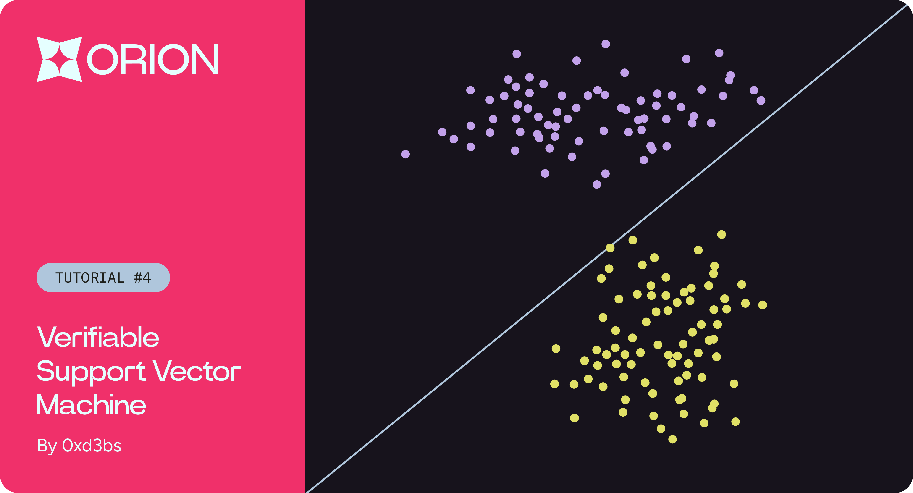
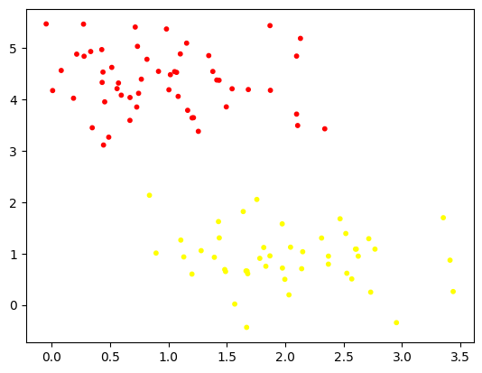
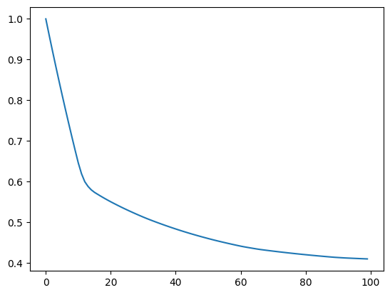
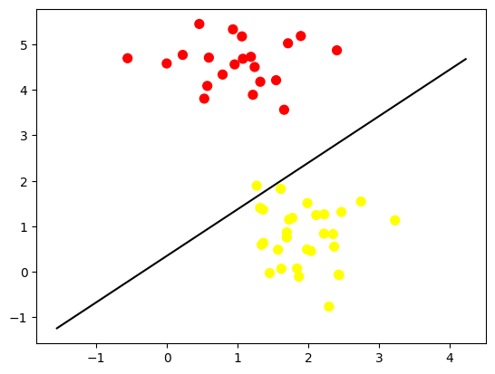

# Verifiable Support Vector Machine

<figure><figcaption></figcaption></figure>


Repository and Notebooks can be found [here](https://github.com/gizatechxyz/orion\_tutorials/tree/main/verifiable\_support\_vector\_machine).


The Support Vector Machines (SVM) model is a supervised learning technique used for classification and regression. It is employed to solve binary classification problems where it identifies the hyperplane that best divides a data set into classes. This hyperplane results from maximizing the margin between the two classes. By determining this optimal hyperplane, predictions can be made for new data points and understand how the input attributes influence classification.

Below, we provide a brief review of implementing an SVM model using the Gradient Descent method for the linear kernel in Python, which we will later convert to Cairo to transform it into a verifiable ZKML (support vector machine model), using [Orion's](../../) library. This allows an opportunity to familiarize oneself with the main functions and operators that the framework offers for the implementation of the SVM.

Content overview:

1. Support Vector Machine with Python: We start with the basic implementation of SVM using gradient descent in Python.
2. Convert your model to Cairo: In the subsequent stage, we will create a new scarb project and replicate our model to Cairo which is a language for creating STARK-provable programs.
3. Implementing SVM model using Orion: To catalyze our development process, we will use the Orion Framework to construct the key functions to build our verifiable SVM classification model.

#### Generating the dataset

For the purposes of this tutorial, we generated linearly separable data using make\_blobs from Scikit-learn

```python
import numpy as np
import matplotlib.pyplot as plt
from sklearn.datasets import make_blobs

X, y = make_blobs(n_samples=150, centers=2,
                  random_state=0, cluster_std=0.60)
y[y == 0] = -1

X = np.hstack((X, np.ones((X.shape[0], 1))))

X_train, y_train = X[:100, :], y[:100]
X_test, y_test = X[100:, :], y[100:]

print(X_train.shape, y_train.shape, X_test.shape, y_test.shape)
```

<figure><figcaption></figcaption></figure>

Upon examining the graph, we notice that the data separates into two distinct groups. Our goal in this tutorial is to differentiate these groups using a Support Vector Machine (SVM). Using the provided data points, we will seek to find an optimal hyperplane that effectively separates these two clusters.

#### Loss function, gradient and Weight init

We will start by generating the key functions for SVM.

Next, we'll define the loss functions and its gradient, with **L2** regularization, both necessary to train our SVM.

In the case of the loss function in SVM, the Hinge Loss,

$$
(\max(0, 1 - y_i \times (\mathbf{w} \cdot \mathbf{x}_i)))
$$

is used, which measures how far a sample is on the "wrong side" of the margin. If the sample is on the correct side of the margin, the loss is 0.

$$Loss Function = \frac{1}{N} \sum_{i=1}^{N} \max(0, 1 - y_i \times (\mathbf{w} \cdot \mathbf{x}_i)) + C \times \frac{1}{2} \times \mathbf{w} \cdot \mathbf{w}$$

$$Gradient = \frac{1}{N} \sum_{i=1}^{N} \left( -y_i \times \mathbf{x}_i \text{ (si } y_i \times (\mathbf{w} \cdot \mathbf{x}_i) < 1 \text{) } \right) + C \times \mathbf{w}$$

For the purposes of this tutorial, we initialize $$mathbf{w}$$as an array of $$mathbf{0's}$$.

```python
def loss_function(w, X, y, C):  
    hinge_loss = np.maximum(0, 1 - y * np.dot(X, w)) 
    regularization_term = 0.5 * np.dot(w, w) 
    total_loss = np.mean(hinge_loss) + C * regularization_term
    return total_loss

def loss_gradient(w, X, y, C):   
    mask = (y * (np.dot(X, w))) < 1    #<1
    gradient = (-np.dot(mask * y, X) / len(y)) +  C*w
    return gradient

losses = []
w = np.zeros(3)
```

#### Initial hyperparameters

Now, we declare the hyperparameters: learning rate (learning\_rate), the number of epochs (num\_epochs), and the regularization parameter (C). Then, we will use gradient descent to adjust the weights of the SVM model. For the purposes of this tutorial, we stick with the following hyperparameters; however, the hyperplane acquisition could be improved with their adjustment.

```python
learning_rate = 0.01
num_epochs = 100
C = 1
```

#### Training

Next, we execute the training of the SVM model, adjusting its parameters to minimize the loss over 100 iterations, and we monitor the training progress by printing the loss.

```python

for epoch in range(num_epochs):
    loss = loss_function(w,X_train, y_train, C)
    losses.append(loss)

    if epoch % 25 == 0 or epoch  == 99:
        print(f"Epoch {epoch}, Loss: {loss:.4f}")

    gradient_w = loss_gradient(w, X_train, y_train,C)
    w -= learning_rate * gradient_w

>>Epoch 0, Loss: 1.0000
>>Epoch 25, Loss: 0.5300
>>Epoch 50, Loss: 0.4594
>>Epoch 75, Loss: 0.4238
>>Epoch 99, Loss: 0.4092
```

<figure><figcaption></figcaption></figure>

After training the model and observing the decrease of the loss function, we evaluate its performance on both the training and test data. We will calculate the accuracy and display the final loss on the training data. In our case, the weights \$$ and the accuracies will be the values against which we compare the SVM implementation in Cairo with Orion.

### Evaluate model on training data

```python
def predict(X, w):
    return np.sign(np.dot(X, w))

predictions = predict(X_train, w)
final_loss = loss_function(w, X_train, y_train,C)

print("Accuracy: {}".format((predictions == y_train).mean()))
print("Final loss: {}".format(final_loss))

>>Accuracy: 0.99
>>Final loss: 0.408927300213472
```

### Evaluate model on test data

```python
predictions = predict(X_test, w)

print("Accuracy: {}".format((predictions == y_test).mean()))

>>Accuracy: 0.98
```

Print w

```python
w

>>array([ 0.36715632, -0.35873007,  0.12536368])
```

Next, we will visualize the obtained hyperplane, determined by $\mathbf{w} = (0.367, -0.358, 0.125)$ and the way it separates the classes in the test data.

```python
plt.scatter(X_test[:, 0], X_test[:, 1], c=y_test, s=50, cmap='autumn')

x_plot = np.linspace(X_test[:, 0].min() - 1, X_test[:, 0].max() + 1, 100)
y_plot = (-w[0] / w[1]) * x_plot - (w[2]/w[1]) #
plt.plot(x_plot, y_plot, 'k-')
```

<figure><figcaption></figcaption></figure>

The equation of the line obtained is $\mathbf{Y} = 1.023\mathbf{X} + 0.349$

### Convert your model to Cairo

Now that we have a good understanding of the SVM models and their key functions, we will replicate the entire model in Cairo to make it fully verifiable. Since we will be rebuilding the model from scratch, this will be a good opportunity to get acquainted with Orion's built-in functions and the operators that make the transition to Cairo seamless.

#### Create a new Scarb project

Scarb is the Cairo package manager specifically created to streamline our Cairo and Starknet development process. Scarb will typically manage project dependencies, the compilation process (both pure Cairo and Starknet contracts), downloading and building external libraries to accelerate our development with Orion.You can find all information about Scarb and Cairo installation here.

To create a new Scarb project, open your terminal and run:

```
scarb new verifiable_support_vector_machine
```

A new project folder will be created for you and make sure to replace the content in Scarb.toml file with the following code:

```toml
[package]
name = "scarb new verifiable_support_vector_machine"
version = "0.1.0"

[dependencies]
orion = { git = "https://github.com/gizatechxyz/orion.git", rev = "v0.1.0" }
```

#### Gerating the dataset in Cairo

Now let's generate the necessary files to begin our transition to Cairo. In our Jupyter Notebook, we'll run the necessary code to convert our dataset obtained with make\_blobs from Scikit-learn into fixed-point values and represent our X\_train, y\_train, X\_test, and y\_test values as fixed-point tensors in Orion.

```python
import os
```

```python
os.makedirs("src/generated", exist_ok=True)
```

```python
tensor_name = ["X_train", "Y_train", "X_test", "Y_test"]

def generate_cairo_files(data, name):

    with open(os.path.join('src', 'generated', f"{name}.cairo"), "w") as f:
        f.write(
            "use array::ArrayTrait;\n" +
            "use orion::operators::tensor::{Tensor, TensorTrait, FP16x16Tensor};\n" +
            "use orion::numbers::{FixedTrait, FP16x16, FP16x16Impl};\n" +
            "\n" + f"fn {name}() -> Tensor<FP16x16>" + "{\n\n" + 
            "let mut shape = ArrayTrait::new();\n"
        )
        for dim in data.shape:
            f.write(f"shape.append({dim});\n")
    
        f.write("let mut data = ArrayTrait::new();")
        for val in np.nditer(data.flatten()):
            f.write(f"data.append(FixedTrait::new({abs(int(decimal_to_fp16x16(val)))}, {str(val < 0).lower()}));\n")
        f.write(
            "let tensor = TensorTrait::<FP16x16>::new(shape.span(), data.span());\n" +
            "return tensor;\n}"
        )

with open(f"src/generated.cairo", "w") as f:
    for n in tensor_name:
        f.write(f"mod {n};\n")

generate_cairo_files(X_train, "X_train")
generate_cairo_files(X_test, "X_test")
generate_cairo_files(y_train, "Y_train")
generate_cairo_files(y_test, "Y_test")
```

The X\_train, y\_train, X\_test and y\_test tensor values will now be generated under `src/generated` directory.

In `src/lib.cairo` replace the content with the following code:

```rust
mod generated;
mod train;
mod test;
mod helper;
```

This will tell our compiler to include the separate modules listed above during the compilation of our code. We will be covering each module in detail in the following section, but let’s first review the generated folder files.

```rust
    use array::ArrayTrait;
    use orion::operators::tensor::{Tensor, TensorTrait, FP16x16Tensor};
    use orion::numbers::{FixedTrait, FP16x16, FP16x16Impl};

    fn X_train() -> Tensor<FP16x16>{

    let mut shape = ArrayTrait::new();
    shape.append(100);
    shape.append(3);
    let mut data = ArrayTrait::new();

    // data has been truncated (only showing the first 5 values out of the 100 values)

    data.append(FixedTrait::new(165613, false));
    data.append(FixedTrait::new(40488, false));
    data.append(FixedTrait::new(65536, false));
    data.append(FixedTrait::new(101228, false));
    data.append(FixedTrait::new(275957, false));
    let tensor = TensorTrait::<FixedType>::new(shape.span(), data.span());
    return tensor;
}
```

Since Cairo does not come with built-in fixed points we have to explicitly define it for our X and y values. Luckily, this is already implemented in Orion for us as a struct as shown below:

```rust
// Example of a FP16x16.
struct FP16x16 {
    mag: u32,
    sign: bool
}
```

For this tutorial, we will use fixed point numbers FP16x16 where the magnitude represents the absolute value and the boolean indicates whether the number is negative or positive. In a 16x16 fixed-point format, there are 16 bits dedicated to the integer part of the number and 16 bits for the fractional part of the number. This format allows us to work with a wide range of values and a high degree of precision for conducting the Tensor operations. To replicate the key functions of SVM, we will conduct our operations using FP16x16 Tensors which are also represented as a structs in Orion.

```rust
struct Tensor<T> {
    shape: Span<usize>,
    data: Span<T>
}
```

A `Tensor` in Orion takes a shape and a span array of the data.

### Implementing SVM models using Orion

At this stage, we will be reproducing the SVM functions now that we have generated our X and Y Fixedpoint Tensors. We will begin by creating a separate file for our svm functions file named `helper.cairo` to host all of our Support vector machine functions.

#### Calculates the loss function.

```rust
fn calculate_loss(
    w: @Tensor<FP16x16>,
    x_train: @Tensor<FP16x16>,
    y_train: @Tensor<FP16x16>,
    c: @Tensor<FP16x16>,
    one_tensor: @Tensor<FP16x16>,
    half_tensor: @Tensor<FP16x16>,
    y_train_len: u32
) -> FP16x16 {
    let tensor_size = FixedTrait::new_unscaled(y_train_len, false);

    let pre_cumsum = *one_tensor - *y_train * x_train.matmul(w);
    let cumsum = pre_cumsum.cumsum(0, Option::None(()), Option::None(()));
    let sum = cumsum.data[pre_cumsum.data.len() - 1];
    let mean = FP16x16Div::div(*sum, tensor_size);

    let mean_tensor = TensorTrait::new(
        shape: array![1].span(), data: array![mean].span(),
    );

    let regularization_term = *half_tensor * (w.matmul(w));
    let loss_tensor = mean_tensor + *c * regularization_term;

    loss_tensor.at(array![0].span())
}
```

#### Calculate the gradient of our loss function

```rust
fn calculate_gradient(
    w: @Tensor<FP16x16>,
    x_train: @Tensor<FP16x16>,
    y_train: @Tensor<FP16x16>,
    c: Tensor<FP16x16>,
    one_tensor: @Tensor<FP16x16>,
    neg_one_tensor: @Tensor<FP16x16>,
    y_train_len: u32
) -> Tensor<FP16x16> {
    let tensor_size = TensorTrait::new(
        shape: array![1].span(),
        data: array![FixedTrait::new_unscaled(y_train_len, false)].span(),
    );

    let mask = (*y_train * x_train.matmul(w));
    let mask = less(@mask, one_tensor);

    let gradient = (((mask * *y_train).matmul(x_train) / tensor_size) * *neg_one_tensor) + (c * *w);

    gradient
}
```

Additionally, within the helper file, we have the following functions implemented to perform training and check the model's accuracy.

```rust
// Calculates the accuracy of the machine learning model's predictions.
fn accuracy(y: @Tensor<FP16x16>, z: @Tensor<FP16x16>) -> FP16x16 {
    let (mut left, mut right) = (y, z);

    let mut right_data = *right.data;
    let mut left_data = *left.data;
    let mut counter = 0;

    loop {
        match right_data.pop_front() {
            Option::Some(item) => {
                let right_current_index = item;
                let left_current_index = left_data.pop_front();
                let (y_value, z_value) = (left_current_index.unwrap(), right_current_index);

                if *y_value == *z_value {
                    counter += 1;
                };
            },
            Option::None(_) => {
                break;
            }
        };
    };

    (FixedTrait::new_unscaled(counter, false) / FixedTrait::new_unscaled((*y.data).len(), false))
        * FixedTrait::new_unscaled(100, false)
}

// Returns the truth value of (x < y) element-wise.
fn less(y: @Tensor<FP16x16>, z: @Tensor<FP16x16>) -> Tensor<FP16x16> {
    let mut data_result = ArrayTrait::<FP16x16>::new();
    let mut data_result2 = ArrayTrait::<FP16x16>::new();
    let (mut smaller, mut bigger, retains_input_order) = if (*y.data).len() < (*z.data).len() {
        (y, z, true)
    } else {
        (z, y, false)
    };

    let mut bigger_data = *bigger.data;
    let mut smaller_data = *smaller.data;
    let mut smaller_index = 0;

    loop {
        match bigger_data.pop_front() {
            Option::Some(item) => {
                let bigger_current_index = item;
                let smaller_current_index = smaller_data[smaller_index];

                let (y_value, z_value) = if retains_input_order {
                    (smaller_current_index, bigger_current_index)
                } else {
                    (bigger_current_index, smaller_current_index)
                };

                if *y_value < *z_value {
                    data_result.append(FixedTrait::ONE());
                } else {
                    data_result.append(FixedTrait::ZERO());
                };

                smaller_index = (1 + smaller_index) % smaller_data.len();
            },
            Option::None(_) => {
                break;
            }
        };
    };

    return TensorTrait::<FP16x16>::new(*bigger.shape, data_result.span());
}

// Returns an element-wise indication of the sign of a number.
fn sign(z: @Tensor<FP16x16>) -> Tensor<FP16x16> {
    let mut data_result = ArrayTrait::<FP16x16>::new();
    let mut z_data = *z.data;

    loop {
        match z_data.pop_front() {
            Option::Some(item) => {
                let result = if *item.sign {
                    FixedTrait::new(ONE, true)
                } else {
                    FixedTrait::new(ONE, false)
                };
                data_result.append(result);
            },
            Option::None(_) => {
                break;
            }
        };
    };

    TensorTrait::<FP16x16>::new(*z.shape, data_result.span())
}

// Returns predictions using the machine learning model.
fn pred(x: @Tensor<FP16x16>, w: @Tensor<FP16x16>) -> Tensor<FP16x16> {
    sign(@(x.matmul(w)))
}
```

Finally, our train.cairo file implements model training using the functions described earlier and is executed as part of our model tests.

```rust
use debug::PrintTrait;
use traits::TryInto;
use array::{ArrayTrait, SpanTrait};
use orion::operators::tensor::{
    Tensor, TensorTrait, FP16x16Tensor, FP16x16TensorAdd, FP16x16TensorMul, FP16x16TensorSub,
    FP16x16TensorDiv
};
use orion::numbers::{FixedTrait, FP16x16, FP16x16Impl};
use orion::numbers::fixed_point::implementations::fp16x16::core::{
    HALF, ONE, FP16x16Mul, FP16x16Div, FP16x16Print, FP16x16IntoI32, FP16x16PartialOrd,
    FP16x16PartialEq
};

use verifiable_support_vector_machine::{helper::{calculate_loss, calculate_gradient}};

// Performs a training step for each iteration during model training
fn train_step(
    x: @Tensor<FP16x16>,
    y: @Tensor<FP16x16>,
    w: @Tensor<FP16x16>,
    learning_rate: FP16x16,
    one_tensor: @Tensor<FP16x16>,
    half_tensor: @Tensor<FP16x16>,
    neg_one_tensor: @Tensor<FP16x16>,
    y_train_len: u32,
    iterations: u32,
    index: u32
) -> Tensor<FP16x16> {
    let learning_rate_tensor = TensorTrait::new(
        shape: array![1].span(), data: array![learning_rate].span()
    );

    let c = TensorTrait::new(
        shape: array![1].span(),
        data: array![FP16x16Impl::ONE()].span(),
    );

    let mut w_recursive = *w;

    let gradient = calculate_gradient(
        @w_recursive, x, y, c, one_tensor, neg_one_tensor, y_train_len
    );

    w_recursive = w_recursive - (learning_rate_tensor * gradient);

    if index == iterations {
        return w_recursive;
    }

    train_step(
        x,
        y,
        @w_recursive,
        learning_rate,
        one_tensor,
        half_tensor,
        neg_one_tensor,
        y_train_len,
        iterations,
        index + 1
    )
}

// Trains the machine learning model.
fn train(
    x: @Tensor<FP16x16>,
    y: @Tensor<FP16x16>,
    init_w: @Tensor<FP16x16>,
    learning_rate: FP16x16,
    y_train_len: u32,
    iterations: u32
) -> (Tensor<FP16x16>, FP16x16, FP16x16) {
    let iter_w = init_w;

    'Iterations'.print();
    iterations.print();

    let c = TensorTrait::new(
        shape: array![1].span(),
        data: array![FP16x16Impl::ONE()].span(),
    );

    let one_tensor = TensorTrait::new(
        shape: array![1].span(),
        data: array![FP16x16Impl::ONE()].span(),
    );

    let half_tensor = TensorTrait::new(
        shape: array![1].span(),
        data: array![FixedTrait::new(HALF, false)].span(),
    );

    let neg_one_tensor = TensorTrait::new(
        shape: array![1].span(),
        data: array![FixedTrait::new(ONE, true)].span(),
    );

    let initial_loss = FixedTrait::<FP16x16>::ZERO();
    let final_loss = FixedTrait::<FP16x16>::ZERO();

    let initial_loss = calculate_loss(init_w, x, y, @c, @one_tensor, @half_tensor, y_train_len);

    let iter_w = train_step(
        x,
        y,
        init_w,
        learning_rate,
        @one_tensor,
        @half_tensor,
        @neg_one_tensor,
        y_train_len,
        iterations,
        1
    );

    let final_loss = calculate_loss(@iter_w, x, y, @c, @one_tensor, @half_tensor, y_train_len);

    (iter_w, initial_loss, final_loss)
}
```

#### Testing the model

Now that we have implemented all the necessary functions for SVM, we can finally test our classification model. We begin by creating a new separate test file named `test.cairo` and import all the necessary Orion libraries, including our X values and y values (train and test) found in the generated folder. We also import all the key functions for SVM from the `helper.cairo` file, as we will rely on them to construct the model.

```rust
use traits::TryInto;
use array::{ArrayTrait, SpanTrait};
use orion::operators::tensor::{
    Tensor, TensorTrait, FP16x16Tensor, FP16x16TensorAdd, FP16x16TensorMul, FP16x16TensorSub,
    FP16x16TensorDiv
};
use orion::numbers::{FixedTrait, FP16x16, FP16x16Impl};
use orion::numbers::fixed_point::implementations::fp16x16::core::{
    HALF, ONE, FP16x16Mul, FP16x16Div, FP16x16IntoI32, FP16x16PartialOrd,
    FP16x16PartialEq
};

use verifiable_support_vector_machine::{
    generated::{X_train::X_train, Y_train::Y_train, X_test::X_test, Y_test::Y_test}, train::{train}
};

use verifiable_support_vector_machine::{helper::{pred, accuracy}};

#[test]
#[available_gas(99999999999999999)]
fn svm_test() {
    let x_train = X_train();
    let x_test = X_test();
    let y_train = Y_train();
    let y_test = Y_test();

    let feature_size = *x_train.shape[1];

    let mut zero_array = ArrayTrait::new();

    let learning_rate = FixedTrait::new(655, false); // 655 is 0.01

    // 50 %
    let average_compare = FixedTrait::new_unscaled(50, false);

    let mut i = 0_u32;
    loop {
        if i >= feature_size {
            break ();
        }
        zero_array.append(FP16x16Impl::ZERO());
        i += 1;
    };

    let initial_w = TensorTrait::new(
        shape: array![feature_size].span(), data: zero_array.span()
    );

    let y_train_len = y_train.data.len();
    let (final_w, initial_loss, final_loss) = train(
        @x_train, @y_train, @initial_w, learning_rate, y_train_len, 100_u32
    );

    let final_y_pred = pred(@x_test, @final_w);
    let average_pred = accuracy(@final_y_pred, @y_test);

    let train_y_pred = pred(@x_train, @final_w);
    let average_train = accuracy(@train_y_pred, @y_train);

    assert(final_loss < initial_loss, 'No decrease in training loss');
    assert(average_pred > average_compare, 'It is better to flip a coin');
    assert(average_train > average_compare, 'It was not a good training');
}
```

Our model will be tested using the `svm_test()` function, which will follow these steps:

1. Data Retrieval : The function starts by fetching the feature values X\_train and y\_train with their labels, both sourced from the generated folder.
2. SVM Construction : Once we have the data, we proceed to train our Support Vector Machine using the X\_train and y\_train values, in line with the functions calculated for this purpose.
3. Hyperplane Retrieval : After training, we obtain our weights "w" that define the hyperplane separating both classes.
4. Prediction Phase : At this stage, we use our trained SVM to make predictions on the test set.
5. Evaluation : At this point, we evaluate the model. We calculate accuracy to measure how well our SVM has classified.
6. Additional Checks : Basic controls are carried out to ensure the model has been trained correctly, and we also verify that our model's accuracy is a better option than flipping a coin.

Finally, we can execute the test file by running `scarb test`

```shell
scarb test
testing verifiable_support_vector_machine ...
running 1 tests

test verifiable_support_vector_machine::test::test ... ok
test result: ok. 1 passed; 0 failed; 0 ignored; 0 filtered out;
```

And as we can our test cases have passed! 👏

If you've made it this far, well done! You are now capable of building verifiable ML models, making them ever more reliable and transparent than ever before.

We invite the community to join us in forging a future in making AI transparent and reliable resource for all.
