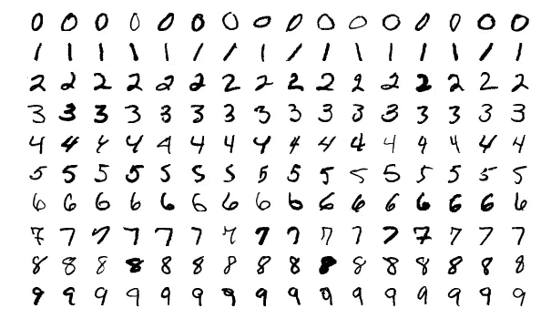
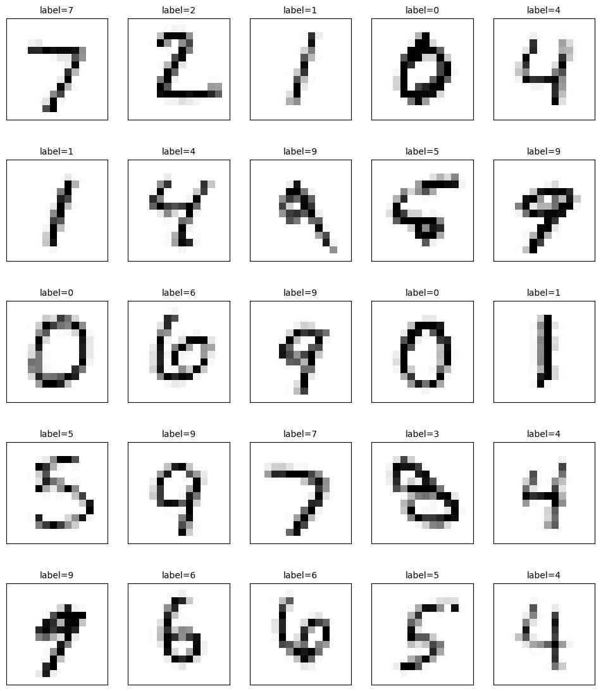

# MNIST Classification with Feedforward Neural Network

Orion is a dedicated Cairo-based library designed specifically to build machine learning models for ValidityML. Its purpose is to facilitate verifiable inference. Orion exclusively operates with 8-bit quantized models, an approach intended to optimize performance. In this tutorial, you will be guided on how to train your model using Quantized Aware Training using MNIST dataset, how to convert your pre-trained model to Cairo 1, and how to perform inference with Orion.


You can find all the code and the notebook in the dedicated [repository.](https://github.com/gizatechxyz/orion\_tutorials)


Here is the content of the tutorial:

1. [What is the MNIST dataset?](mnist-classification-with-feedforward-neural-network.md#what-is-mnist-dataset)
2. [Train your model with Quantization-Aware Training](mnist-classification-with-feedforward-neural-network.md#train-your-model-with-quantization-aware-training)
3. [Convert your model to Cairo](mnist-classification-with-feedforward-neural-network.md#convert-your-model-to-cairo)
4. [Perform inference with Orion](mnist-classification-with-feedforward-neural-network.md#perform-inference-with-orion)

## What is MNIST dataset?

The MNIST dataset is an extensive collection of handwritten digits, very popular in the field of image processing. Often, it's used as a reference point for machine learning algorithms. This dataset conveniently comes already partitioned into training and testing sets, a feature we'll delve into later in this tutorial.

The MNIST database comprises a collection of 70,000 images of handwritten digits, ranging from 0 to 9. Each image measures 28 x 28 pixels.

<figure><figcaption><p>Source: Wikimedia</p></figcaption></figure>

## Train the model with Quantization-Aware Training&#x20;

We will be using [Tensorflow](https://www.tensorflow.org/) to train a neural network to recognize MNIST's handwritten digits in this tutorial. TensorFlow is a very popular framework for deep learning.&#x20;

### Dataset Preparation

In a notebook, import the required libraries and load the dataset.

```python
from tensorflow import keras
from keras.datasets import mnist
from scipy.ndimage import zoom
import numpy as np

(x_train, y_train), (x_test, y_test) = mnist.load_data()
```

We have a total of 70,000 grayscale images, each with a dimension of 28 x 28 pixels. 60,000 images are for training and the remaining 10,000 are for testing.&#x20;

We now need to pre-process our data. For the purposes of this tutorial and performance, we'll resize the images to 14 x 14 pixels. You'll see later that the neural network's input layer supports a 1D tensor. We, therefore, need to flatten and normalize our data.

```python
# Resizing function
def resize_images(images):
    return np.array([zoom(image, 0.5) for image in images])

# Resize
x_train = resize_images(x_train)
x_test = resize_images(x_test)

# Then reshape
x_train = x_train.reshape(60000, 14*14)
x_test = x_test.reshape(10000, 14*14)
x_train = x_train.astype('float32')
x_test = x_test.astype('float32')

# normalize to range [0, 1]
x_train /= 255
x_test /= 255
```

### Model Definition and Training

We will design a straightforward feedforward neural network. Here's the model architecture we'll use:\


<figure><figcaption><p>Model architecture visualization from Netron.app</p></figcaption></figure>

This model is composed of an input layer with a shape of 14\*14, followed by two dense layers, each containing 10 neurons. The first dense layer uses a ReLU activation function, while the second employs a softmax activation function. Let's implement this architecture in the code.

```python
from tensorflow.keras import layers

num_classes = 10

model = keras.Sequential([
    keras.layers.InputLayer(input_shape=(14*14,)),
    keras.layers.Dense(10, activation='relu'), 
    keras.layers.Dense(10, activation='softmax')
])

model.compile(optimizer='adam', 
              loss='sparse_categorical_crossentropy', 
              metrics=['accuracy'])
              
```

Now let's train this model on our training data.

```python
batch_size = 256
epochs = 10
history = model.fit(x_train, y_train,
                    epochs=epochs,
                    validation_split=0.2)
                    
```

```python
Epoch 1/10
1500/1500 [==============================] - 1s 438us/step - loss: 0.8641 - accuracy: 0.7506 - val_loss: 0.3855 - val_accuracy: 0.8947
Epoch 2/10
1500/1500 [==============================] - 1s 391us/step - loss: 0.3713 - accuracy: 0.8953 - val_loss: 0.3160 - val_accuracy: 0.9096
Epoch 3/10
1500/1500 [==============================] - 1s 397us/step - loss: 0.3252 - accuracy: 0.9070 - val_loss: 0.2916 - val_accuracy: 0.9150
Epoch 4/10
1500/1500 [==============================] - 1s 389us/step - loss: 0.3041 - accuracy: 0.9122 - val_loss: 0.2758 - val_accuracy: 0.9207
Epoch 5/10
1500/1500 [==============================] - 1s 393us/step - loss: 0.2917 - accuracy: 0.9153 - val_loss: 0.2672 - val_accuracy: 0.9237
Epoch 6/10
1500/1500 [==============================] - 1s 386us/step - loss: 0.2827 - accuracy: 0.9187 - val_loss: 0.2599 - val_accuracy: 0.9258
Epoch 7/10
1500/1500 [==============================] - 1s 391us/step - loss: 0.2752 - accuracy: 0.9201 - val_loss: 0.2554 - val_accuracy: 0.9273
Epoch 8/10
1500/1500 [==============================] - 1s 390us/step - loss: 0.2685 - accuracy: 0.9218 - val_loss: 0.2525 - val_accuracy: 0.9282
Epoch 9/10
1500/1500 [==============================] - 1s 391us/step - loss: 0.2635 - accuracy: 0.9235 - val_loss: 0.2491 - val_accuracy: 0.9303
Epoch 10/10
1500/1500 [==============================] - 1s 392us/step - loss: 0.2593 - accuracy: 0.9256 - val_loss: 0.2467 - val_accuracy: 0.9302
```

At this point, we have trained a regular model.&#x20;

### Making the model Quantization Aware

The aim of this tutorial is to guide you through the process of performing verifiable inference with the Orion library. As stated before, Orion exclusively performs inference on 8-bit quantized models. Typically, quantization is executed via two distinct methods: Quantization Aware Training (QAT) or Post-Training Quantization (PTQ), which occurs after the training phase. In this tutorial we will use QAT method.&#x20;

Concretely QAT is a method where the quantization error is emulated during the training phase itself. In this process, the weights and activations of the model are quantized, and this information is used during both the forward and backward passes of training. This allows the model to learn and adapt to the quantization error. It ensures that once the model is fully quantized post-training, it has already accounted for the effects of quantization, resulting in improved accuracy.

We will use TensorFlow Model Optimization Toolkit to finetune the pre-trained model for QAT.

```python
import tensorflow_model_optimization as tfmot

# Apply quantization to the layers
quantize_model = tfmot.quantization.keras.quantize_model

q_aware_model = quantize_model(model)

# 'quantize_model' requires a recompile
q_aware_model.compile(optimizer='adam',
                      loss='sparse_categorical_crossentropy',
                      metrics=['accuracy'])

q_aware_model.summary()

```

```
Model: "sequential"
_________________________________________________________________
 Layer (type)                Output Shape              Param #   
=================================================================
 quantize_layer (QuantizeLa  (None, 196)               3         
 yer)                                                            
                                                                 
 quant_dense (QuantizeWrapp  (None, 10)                1975      
 erV2)                                                           
                                                                 
 quant_dense_1 (QuantizeWra  (None, 10)                115       
 pperV2)                                                         
                                                                 
=================================================================
Total params: 2093 (8.18 KB)
Trainable params: 2080 (8.12 KB)
Non-trainable params: 13 (52.00 Byte)
_________________________________________________________________
```

We have now created a new model, `q_aware_model`, which is a quantization-aware version of our original model. Now we can train this model exactly like our original model.

```python
batch_size = 256
epochs = 10
history = q_aware_model.fit(x_train, y_train,
                            epochs=epochs,
                            validation_split=0.2)

scores, acc = q_aware_model.evaluate(x_test, y_test, verbose=0)
print('Test loss:', scores)
print('Test accuracy:', acc)
```

```python
Epoch 1/10
1500/1500 [==============================] - 1s 563us/step - loss: 0.2623 - accuracy: 0.9245 - val_loss: 0.2499 - val_accuracy: 0.9293
Epoch 2/10
1500/1500 [==============================] - 1s 503us/step - loss: 0.2539 - accuracy: 0.9260 - val_loss: 0.2473 - val_accuracy: 0.9296
Epoch 3/10
1500/1500 [==============================] - 1s 508us/step - loss: 0.2509 - accuracy: 0.9260 - val_loss: 0.2454 - val_accuracy: 0.9289
Epoch 4/10
1500/1500 [==============================] - 1s 520us/step - loss: 0.2484 - accuracy: 0.9278 - val_loss: 0.2444 - val_accuracy: 0.9293
Epoch 5/10
1500/1500 [==============================] - 1s 533us/step - loss: 0.2464 - accuracy: 0.9284 - val_loss: 0.2428 - val_accuracy: 0.9293
Epoch 6/10
1500/1500 [==============================] - 1s 516us/step - loss: 0.2440 - accuracy: 0.9282 - val_loss: 0.2409 - val_accuracy: 0.9309
Epoch 7/10
1500/1500 [==============================] - 1s 540us/step - loss: 0.2424 - accuracy: 0.9286 - val_loss: 0.2417 - val_accuracy: 0.9308
Epoch 8/10
1500/1500 [==============================] - 1s 517us/step - loss: 0.2409 - accuracy: 0.9294 - val_loss: 0.2391 - val_accuracy: 0.9304
Epoch 9/10
1500/1500 [==============================] - 1s 539us/step - loss: 0.2391 - accuracy: 0.9292 - val_loss: 0.2406 - val_accuracy: 0.9316
Epoch 10/10
1500/1500 [==============================] - 1s 518us/step - loss: 0.2380 - accuracy: 0.9294 - val_loss: 0.2428 - val_accuracy: 0.9304
Test loss: 0.246782124042511
Test accuracy: 0.928600013256073
```

### Converting to TFLite Format

Now, we will convert our model to TFLite format, which is a format optimized for on-device machine learning.

```python
import tensorflow as tf

# Create a converter
converter = tf.lite.TFLiteConverter.from_keras_model(q_aware_model)

# Indicate that you want to perform default optimizations,
# which include quantization
converter.optimizations = [tf.lite.Optimize.DEFAULT]

# Define a generator function that provides your test data's numpy arrays
def representative_data_gen():
  for i in range(500):
    yield [x_test[i:i+1]]

# Use the generator function to guide the quantization process
converter.representative_dataset = representative_data_gen

# Ensure that if any ops can't be quantized, the converter throws an error
converter.target_spec.supported_ops = [tf.lite.OpsSet.TFLITE_BUILTINS_INT8]

# Set the input and output tensors to int8
converter.inference_input_type = tf.int8
converter.inference_output_type = tf.int8

# Convert the model
tflite_model = converter.convert()

# Save the model to disk
open("q_aware_model.tflite", "wb").write(tflite_model)
```

### Testing the Quantized Model

Now that we have trained a quantization-aware model and converted it to the TFLite format, we can perform inference using the TensorFlow Lite interpreter to test it.

We first load the TFLite model and allocate the required tensors. The Interpreter class provides methods for loading a model and running inferences.

```python
# Load the TFLite model and allocate tensors.
interpreter = tf.lite.Interpreter(model_path="q_aware_model.tflite")
interpreter.allocate_tensors()
```

Next, we get the details of the input and output tensors. Each tensor in a TensorFlow Lite model has a name, index, shape, data type, and quantization parameters. These can be accessed via the input\_details and output\_details methods.

```python
# Get input and output tensors.
input_details = interpreter.get_input_details()
output_details = interpreter.get_output_details()

```

Before performing the inference, we need to normalize the input to match the data type of our model's input tensor, which in our case is int8. Then, we use the `set_tensor` method to provide the input data to the model. We perform the inference using the invoke method.

```python
# Normalize the input value to int8
input_shape = input_details[0]['shape']
input_data = np.array(x_test[0:1], dtype=np.int8)
interpreter.set_tensor(input_details[0]['index'], input_data)

# Perform the inference
interpreter.invoke()

# Get the result
output_data = interpreter.get_tensor(output_details[0]['index'])
print(output_data)

>>>>
[[-128 -128   -6   -6 -128 -116 -128 -128 -128 -128]]

```

Now, we are going to run the inference for the entire test set.

We normalize the entire test set and initialize an array to store the predictions.

```python
(_, _), (x_test_image, y_test_label) = mnist.load_data()

# Resize and Normalize x_test_image to int8
x_test_image = resize_images(x_test_image)
x_test_image_norm = (x_test_image / 255.0 * 255 - 128).astype(np.int8)

# Initialize an array to store the predictions
predictions = []

```

We then iterate over the test set, making predictions. For each image, we flatten the image, normalize it, and then expand its dimensions to match the shape of our model's input tensor.

```python
# Iterate over the test data and make predictions
for i in range(len(x_test_image_norm)):
    test_image = np.expand_dims(x_test_image_norm[i].flatten(), axis=0)
    
    # Set the value for the input tensor
    interpreter.set_tensor(input_details[0]['index'], test_image)
    
    # Run the inference
    interpreter.invoke()

    output = interpreter.get_tensor(output_details[0]['index'])
    predictions.append(output)
    
```

Finally, we use a function to plot the test images along with their predicted labels. This will give us a visual representation of how well our model is performing.

<figure><figcaption></figcaption></figure>

We have successfully trained a quantization-aware model, converted it to the TFLite format, and performed inference using the TensorFlow Lite interpreter.

Now let's convert the pre-trained model to Cairo, in order to perform verifiable inference with Orion library.

## Convert your model to Cairo

In this section, you will generate Cairo files for each bias and weight of the model.&#x20;

### Create a new Scarb project

Scarb is a Cairo package manager. We will use Scarb to run inference with Orion. You can find all information about Scarb and Cairo installation [here](../../apis/get-started.md#installations).

Let's create a new Scarb project. In your terminal run:

```sh
scarb new mnist_nn
```

Replace the content in Scarb.toml file with the following code:

```toml
[package]
name = "mnist_nn"
version = "0.1.0"

[dependencies]
orion = { git = "https://github.com/gizatechxyz/orion.git" }

[scripts]
test = "scarb cairo-test -f mnist_nn_test"
```

Finally, place the notebook and `q_aware_model.tflite` file in the `mnist_nn` directory. We are now ready to generate Cairo files from the pre-trained model.

### Generate Cairo files

In a new notebook's cell load TFLite and allocate tensors.

```python
# Load the TFLite model and allocate tensors.
interpreter = tf.lite.Interpreter(model_path="q_aware_model.tflite")
interpreter.allocate_tensors()
```

Then, create an object with an input from the dataset, and all weights and biases.

```python
# Create an object with all tensors 
#(an input + all weights and biases)
tensors = {
    "input": x_test_image[0].flatten(),
    "fc1_weights": interpreter.get_tensor(1), 
    "fc1_bias": interpreter.get_tensor(2), 
    "fc2_weights": interpreter.get_tensor(4), 
    "fc2_bias": interpreter.get_tensor(5)
}
```

Now let's generate Cairo files for each tensor in the object.&#x20;

<pre class="language-python"><code class="lang-python"># Create the directory if it doesn't exist
os.makedirs('src/generated', exist_ok=True)

for tensor_name, tensor in tensors.items():
    with open(os.path.join('src', 'generated', f"{tensor_name}.cairo"), "w") as f:
        f.write(
           <a data-footnote-ref href="#user-content-fn-1"> "use core::array::ArrayTrait;\n" +</a>
            "use orion::operators::tensor::core::{TensorTrait, Tensor, ExtraParams};\n" +
            "use orion::operators::tensor::implementations::impl_tensor_i32::Tensor_i32;\n" +
            "use orion::numbers::fixed_point::core::FixedImpl;\n" +
            "use orion::numbers::signed_integer::i32::i32;\n\n" +
            "fn {0}() -> Tensor&#x3C;i32> ".format(tensor_name) + "{\n" +
            "    let mut shape = ArrayTrait::&#x3C;usize>::new();\n"
        )
        for dim in tensor.shape:
            f.write("    shape.append({0});\n".format(dim))
        f.write(
            "    let mut data = ArrayTrait::&#x3C;i32>::new();\n"
        )
        for val in np.nditer(tensor.flatten()):
            f.write("    data.append(i32 {{ mag: {0}, sign: {1} }});\n".format(abs(int(val)), str(val &#x3C; 0).lower()))
        f.write(
            "let extra = ExtraParams { fixed_point: Option::Some(FixedImpl::FP16x16(())) }; \n" +
            "    TensorTrait::new(shape.span(), data.span(), Option::Some(extra))\n" +
            "}\n"
        )
      
with open(os.path.join('src', 'generated.cairo'), 'w') as f:
    for param_name in tensors.keys():
        f.write(f"mod {param_name};\n")

</code></pre>

Your Cairo files are generated in `src/generated` directory.

In `src/lib.cairo` replace the content with the following code:

```rust
mod generated;
```

We have just created a file called `lib.cairo`, which contains a module declaration referencing another module named `generated`.

### Let's analyze the generated files

Here is a file we generated: `fc1_bias.cairo`

```rust
use core::array::ArrayTrait;
use orion::operators::tensor::core::{TensorTrait, Tensor, ExtraParams};
use orion::operators::tensor::implementations::impl_tensor_i32::Tensor_i32;
use orion::numbers::fixed_point::core::FixedImpl;
use orion::numbers::signed_integer::i32::i32;

fn fc1_bias() -> Tensor<i32> {
    let mut shape = ArrayTrait::<usize>::new();
    shape.append(10);
    let mut data = ArrayTrait::<i32>::new();
    data.append(i32 { mag: 1300, sign: true });
    data.append(i32 { mag: 7644, sign: false });
    data.append(i32 { mag: 472, sign: true });
    data.append(i32 { mag: 3601, sign: false });
    data.append(i32 { mag: 5538, sign: false });
    data.append(i32 { mag: 5476, sign: false });
    data.append(i32 { mag: 3879, sign: false });
    data.append(i32 { mag: 3268, sign: true });
    data.append(i32 { mag: 1979, sign: false });
    data.append(i32 { mag: 1435, sign: false });
let extra = ExtraParams { fixed_point: Option::Some(FixedImpl::FP16x16(())) }; 
    TensorTrait::new(shape.span(), data.span(), Option::Some(extra))
}
```

`fc1_bias` is a `i32` `Tensor` two concepts that deserve a closer look.

#### Signed Integer in Orion

In Cairo, there are no built-in signed integers. However, in the field of machine learning, they are very useful. So Orion introduced a full implementation of [Signed Integer](../../apis/numbers/signed-integer/). It is represented by a struct containing both the magnitude and its sign as a boolean.

The magnitude represents the absolute value of the number, and the sign indicates whether the number is positive or negative.

```rust
// Example of an i32.
struct i32 {
    mag: u32,
    sign: bool, // true means a negative sign.
}
```

#### Tensor in Orion

The second concept Orion introduced is the [Tensor](../../apis/operators/tensor/). We've used it extensively in previous sections, the tensor is a central object in machine learning. It is represented in Orion as a struct containing the tensor's shape, a flattened array of its data, and extra parameters. The generic Tensor is defined as follows:

```rust
struct Tensor<T> {
    shape: Span<usize>,
    data: Span<T>
    extra: Option<ExtraParams>
}
```

`ExtraParams` is a struct containing additional parameters for the tensor. The `fixed_point` parameter specifies the fixed-point implementation to be used when a tensor operation uses fixed points.

```rust
struct ExtraParams {
    fixed_point: Option<FixedImpl>
}
```

You should now be able to understand the content in generated files.

## Perform Inference with Orion

We have now reached the last part of our tutorial, performing ML inference in Cairo 1.0.

### How to Build a Neural Network with Orion

In this subsection, we will reproduce the same model architecture defined earlier in the training phase with Tensorflow, but with Orion, as the aim is to perform the inference in Cairo.

In `src` folder, create a `nn.cairo` file and reference the module in `lib.cairo` as follow:

```rust
mod generated;
mod nn;
```

Now, let's build the layers of our neural network in `nn.cairo`. As a reminder, this was the architecture of the model we defined earlier:&#x20;

`Input -> FC1 (activation = 'relu') -> FC2 (activation= 'softmax') -> Output`

#### Dense Layer 1

In `nn.cairo` let's create a function `fc1` that takes three parameters:

* `i: Tensor<i32>` - A tensor of `i32` values representing the input data.
* `w: Tensor<i32>` - A tensor of `i32` values representing the weights of the first layer.
* `b: Tensor<i32>` - A tensor of `i32` values representing the biases of the first layer.

It should return a `Tensor<i32>`.

```rust
use orion::operators::tensor::core::Tensor;
use orion::numbers::signed_integer::i32::i32;

fn fc1(i: Tensor<i32>, w: Tensor<i32>, b: Tensor<i32>) -> Tensor<i32> {
    // ...
}
```

To build the first layer, we need a [Linear](../../apis/operators/neural-network/nn.linear.md) function and a [ReLU](../../apis/operators/neural-network/nn.relu.md) from [NNTrait](../../apis/operators/neural-network/).

```rust
use orion::operators::tensor::core::Tensor;
use orion::numbers::signed_integer::{integer_trait::IntegerTrait, i32::i32};
use orion::operators::nn::core::NNTrait;
use orion::numbers::fixed_point::core::FixedType;
use orion::operators::nn::implementations::impl_nn_i32::NN_i32;

fn fc1(i: Tensor<i32>, w: Tensor<i32>, b: Tensor<i32>) -> Tensor<i32> {
    let x = NNTrait::linear(i, w, b, true); // `true` because we want to quantize the result
    NNTrait::relu(@x, IntegerTrait::new(0, false))
}
```

#### Dense Layer 2

In a similar way, we can build the second layer `fc2`, which contains a [Linear](../../apis/operators/neural-network/nn.linear.md) function and a [Softmax](../../apis/operators/neural-network/nn.softmax.md) from [NNTrait](../../apis/operators/neural-network/). Because after a softmax the output tensor lies in the interval \[0,1], floating points are represented by [fixed points](../../apis/numbers/fixed-point/). This is why `fc2` returns `Tensor<FixedType>`.

```rust
use orion::operators::tensor::core::Tensor;
use orion::numbers::signed_integer::{integer_trait::IntegerTrait, i32::i32};
use orion::operators::nn::core::NNTrait;
use orion::numbers::fixed_point::core::FixedType;
use orion::operators::nn::implementations::impl_nn_i32::NN_i32;

fn fc1(i: Tensor<i32>, w: Tensor<i32>, b: Tensor<i32>) -> Tensor<i32> {
    let x = NNTrait::linear(i, w, b, true);
    NNTrait::relu(@x, IntegerTrait::new(0, false))
}

fn fc2(i: Tensor<i32>, w: Tensor<i32>, b: Tensor<i32>) -> Tensor<FixedType> {
    let x = NNTrait::linear(i, w, b, true);
    NNTrait::softmax(@x, 0)
}
```

We are now ready to perform inference!

### Make Prediction

In `src` folder, create a `test.cairo` file and reference the module in `lib.cairo` as follow:

```rust
mod generated;
mod nn;
mod test;
```

In your test file, create a function `mnist_nn_test`.&#x20;

```rust
#[test]
#[available_gas(99999999999999999)]
fn mnist_nn_test() {
    //...
}
```

Now let's import and set the input data and the parameters generated previously.&#x20;

```rust
use mnist_nn::generated::input::input;
use mnist_nn::generated::fc1_bias::fc1_bias;
use mnist_nn::generated::fc1_weights::fc1_weights;
use mnist_nn::generated::fc2_bias::fc2_bias;
use mnist_nn::generated::fc2_weights::fc2_weights;

#[test]
#[available_gas(99999999999999999)]
fn mnist_nn_test() {
    let input = input();
    let fc1_bias = fc1_bias();
    let fc1_weights = fc1_weights();
    let fc2_bias = fc2_bias();
    let fc2_weights = fc2_weights();
}
```

Then import and set the neural network we built just above.

```rust
use mnist_nn::nn::fc1;
use mnist_nn::nn::fc2;
use mnist_nn::generated::input::input;
use mnist_nn::generated::fc1_bias::fc1_bias;
use mnist_nn::generated::fc1_weights::fc1_weights;
use mnist_nn::generated::fc2_bias::fc2_bias;
use mnist_nn::generated::fc2_weights::fc2_weights;

#[test]
#[available_gas(99999999999999999)]
fn mnist_nn_test() {
    let input = input();
    let fc1_bias = fc1_bias();
    let fc1_weights = fc1_weights();
    let fc2_bias = fc2_bias();
    let fc2_weights = fc2_weights();

    let x = fc1(input, fc1_weights, fc1_bias);
    let x = fc2(x, fc2_weights, fc2_bias);
}
```

Finally, let's make a prediction. The input data represents the digit 7. The probability at index 7 must therefore be close to 1.

```rust
use core::array::SpanTrait;

use mnist_nn::nn::fc1;
use mnist_nn::nn::fc2;
use mnist_nn::generated::input::input;
use mnist_nn::generated::fc1_bias::fc1_bias;
use mnist_nn::generated::fc1_weights::fc1_weights;
use mnist_nn::generated::fc2_bias::fc2_bias;
use mnist_nn::generated::fc2_weights::fc2_weights;

use orion::operators::tensor::implementations::impl_tensor_fp::Tensor_fp;

#[test]
#[available_gas(99999999999999999)]
fn mnist_nn_test() {
    let input = input();
    let fc1_bias = fc1_bias();
    let fc1_weights = fc1_weights();
    let fc2_bias = fc2_bias();
    let fc2_weights = fc2_weights();

    let x = fc1(input, fc1_weights, fc1_bias);
    let x = fc2(x, fc2_weights, fc2_bias);

    assert(*x.data.at(0).mag == 0, 'proba x is 0 -> 0');
    assert(*x.data.at(1).mag == 0, 'proba x is 1 -> 0');
    assert(*x.data.at(2).mag == 0, 'proba x is 2 -> 0');
    assert(*x.data.at(3).mag == 0, 'proba x is 3 -> 0');
    assert(*x.data.at(4).mag == 0, 'proba x is 4 -> 0');
    assert(*x.data.at(5).mag == 0, 'proba x is 5 -> 0');
    assert(*x.data.at(6).mag == 0, 'proba x is 6 -> 0');
    assert(*x.data.at(7).mag > 62259, 'proba x is 7 -> 1'); // 62259 represents ONE in fp16x16.
    assert(*x.data.at(8).mag == 0, 'proba x is 8 -> 0');
    assert(*x.data.at(9).mag == 0, 'proba x is 9 -> 0');
}

```

Test your model by running `scarb cairo-test -f mnist_nn_test`.

```sh
testing mnist_nn ...
running 1 tests
test mnist_nn::test::mnist_nn_test ... ok
test result: ok. 1 passed; 0 failed; 0 ignored; 0 filtered out;
```

Bravo 👏 You can be proud of yourself! You just built your first Neural Network in Cairo 1.0 with Orion.&#x20;

Orion leverages Cairo to guarantee the reliability of inference, providing developers with a user-friendly framework to build complex and verifiable machine learning models. We invite the community to join us in shaping a future where trustworthy AI becomes a reliable resource for all.

<table data-card-size="large" data-view="cards"><thead><tr><th></th><th align="center"></th><th></th><th data-hidden data-card-target data-type="content-ref"></th></tr></thead><tbody><tr><td></td><td align="center"><mark style="color:orange;"><strong>Join Discord Community</strong></mark></td><td></td><td><a href="https://discord.gg/yqWB57XNYg">https://discord.gg/yqWB57XNYg</a></td></tr><tr><td></td><td align="center"><mark style="color:orange;"><strong>Get Started Orion</strong></mark></td><td></td><td><a href="https://orion.gizatech.xyz/framework/get-started">https://orion.gizatech.xyz/framework/get-started</a></td></tr></tbody></table>

[^1]: Maybe for this to make it a bit cleaner we could use triple quotes so we don't have to add "\n" on each line
