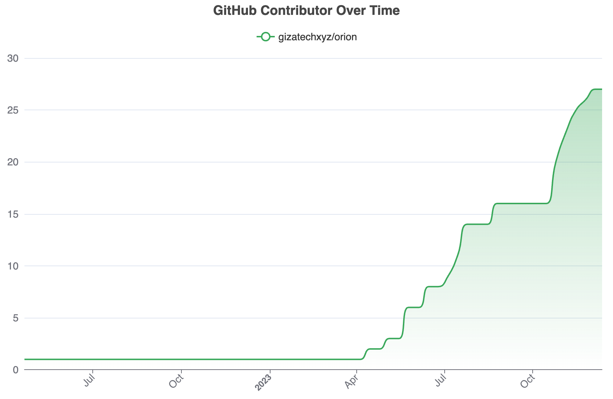
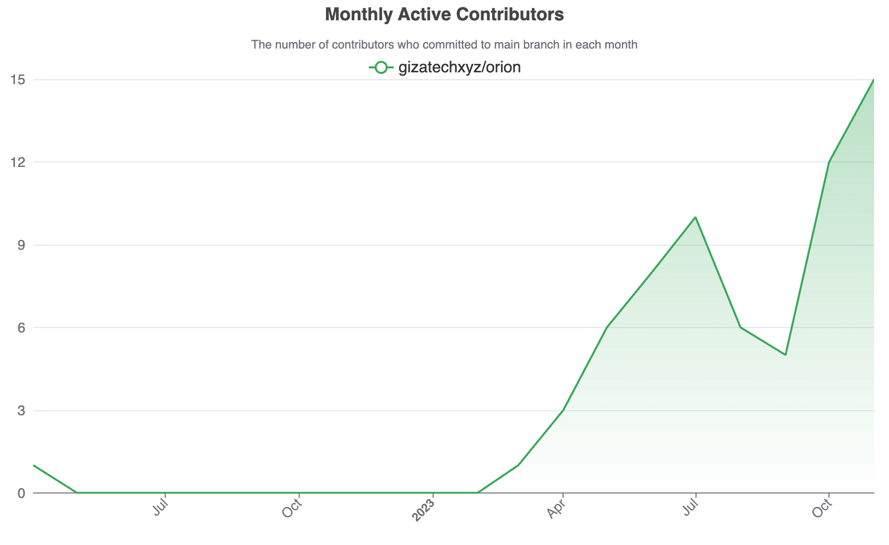

# Orion Usage

*Last Update: 12 dec. 2023*

## Contributors

## Tutorials

Learn how to use Orion with tutorials. We encourage you to contribute by sharing your own tutorial.

| Author          | Title                                                                                                                          |
| --------------- | ------------------------------------------------------------------------------------------------------------------------------ |
| 0xd3bs          | [Verifiable Support Vector Machine](https://orion.gizatech.xyz/academy/tutorials/verifiable-support-vector-machine)            |
| Bem Baraki      | [Verifiable Linear Regression Model](https://orion.gizatech.xyz/academy/tutorials/verifiable-linear-regression-model-in-orion) |
| Raphael Doukhan | [Implement new operators in Orion](https://orion.gizatech.xyz/academy/tutorials/implement-new-operators-in-orion)              |
| Raphael Doukhan | [MNIST Classification with Orion](https://orion.gizatech.xyz/academy/tutorials/mnist-classification-with-orion)                |

## Models

Discover ML models made by the community with Orion!

| Author          | Title                                                                                                                 |
| --------------- | --------------------------------------------------------------------------------------------------------------------- |
| Raphael Doukhan | [Tic-Tac-Stark](https://github.com/gizatechxyz/Tic-Tac-Stark)                                                         |
| 0xd3bs          | [SVM](https://github.com/gizatechxyz/orion_tutorials/blob/main/verifiable_support_vector_machine/notebooks/svm.ipynb) |
| Bowen           | [Logistic Regression](https://github.com/bowenyou/cairo-logistic-regression)                                          |
| Bem Baraki      | [Linear Regression](https://github.com/BemTG/Verifiable-Linear-Regression-)                                           |
| Raphael Doukhan | [MNIST MLP](https://github.com/gizatechxyz/orion_tutorials/blob/main/mnist_nn/QAT_MNIST_MLP.ipynb)                    |

# Spaces 

Discover amazing ML apps and POCs made by the community with Orion!

| Author                            | Title                                                                                       |
| --------------------------------- | ------------------------------------------------------------------------------------------- |
| ownerofjk, umburloko, coostendorp | [Tic Tac Toe in PixeLAW with ML Bot](https://github.com/OwnerOfJK/TicTacToeAgent/tree/main) |
| John William Q. Embate, Plutarch Romiel Degollacion| [ZKML Solar PV Positioning Optimizer Module](https://taikai.network/starkware/hackathons/starknet-infra-hackathon/projects/clpnv5gav00d6x401lol9jaf8/idea) |

## Hackathon Projects

| Author                            | Event          | Title                                                                                       | Prizes             |
| --------------------------------- | -------------- | ------------------------------------------------------------------------------------------- | ------------------ |
| manuj-mishra                      | Lambda ZK week | [ZK Differential Privacy](https://github.com/manuj-mishra/zkdiffpriv)                       | 🏅                  |
| codingnirvana                     | Lambda ZK week | [Cairo Convolution ](https://github.com/gizatechxyz/orion/pull/160)                         |                    |
| danilo, richie, falco             | ETHGlobal      | [Cairo Einsum](https://x.com/danilowhk2/status/1683138159985545216?s=20)                    | 🥇 (Starknet track) |
| 0xbyyou                           | ETHToronto     | [Cairo Logistic Regression](https://x.com/gizatechxyz/status/1695016787698417770?s=20)      |                    |
| ownerofjk, umburloko, coostendorp | ETHGlobal Ist. | [Tic Tac Toe in PixeLAW with ML Bot](https://github.com/OwnerOfJK/TicTacToeAgent/tree/main) | 🥇 (Starknet track) |
| John William Q. Embate, Plutarch Romiel Degollacion| STARKNET INFRA HACKATHON | [ZKML Solar PV Positioning Optimizer Module](https://taikai.network/starkware/hackathons/starknet-infra-hackathon/projects/clpnv5gav00d6x401lol9jaf8/idea) | |

## Use Cases 

| Author                  | Title                              | Description                                                                                                                                                     |
| ----------------------- | ---------------------------------- | --------------------------------------------------------------------------------------------------------------------------------------------------------------- |
| StorSwift               | Verifiable Medical Diagnosis       | A verifiable medical diagnosis web3 app. The aim is to create a robust and reliable platform to empower individuals in their healthcare decision-making process |
| dblancove & dataonchain | Fraud Detection with Verifiable ML | A verifiable anomaly detection model in fraud detection and analysis of bank transaction alerts.                                                                |
| John William Q. Embate, Plutarch Romiel Degollacion|[ZKML Solar PV Positioning Optimizer Module](https://taikai.network/starkware/hackathons/starknet-infra-hackathon/projects/clpnv5gav00d6x401lol9jaf8/idea) | The ZKML-powered Solar PV Positioning Optimizer Module ensures efficient solar energy use through data-driven reporting and precise PV positioning in the pre-installation phase. |
| Zion | Onairos | Onairos is a groundbreaking platform that combines the power of AI, Data Privacy, and Blockchain to create digital personalities. These digital personalities represent individuals and help users interact with the online world while retaining control over their data |
